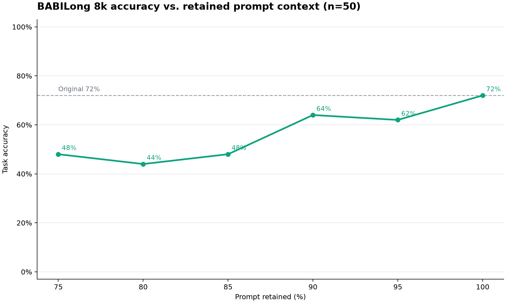

# Alexandria

[](https://github.com/ucsc-cse115a-alexandria/alexandria/tree/python-coverage-comment-action-data)

Label-free prompt optimization: shorten instruction-heavy prompts while preserving their meaning.
Alexandria finds near-duplicate instructions with sentence embeddings and has an LLM merge each pair
into a single rewritten sentence — no labels, no training, no target output to compare against.

## Install

Alexandria is currently version `0.1.0`; its pre-1.0 API may still change. It requires Python 3.14
and [uv](https://docs.astral.sh/uv/).

```bash
# CLI
uv tool install git+https://github.com/ucsc-cse115a-alexandria/alexandria.git

# or run once without installing
uvx --from git+https://github.com/ucsc-cse115a-alexandria/alexandria.git alexandria reduce prompt.txt

# as a library dependency
uv add git+https://github.com/ucsc-cse115a-alexandria/alexandria.git
```

The package is distributed as `alexandria-prompt`; the import name is `alexandria`. The examples
below use the installed `alexandria` command; from a development checkout, substitute
`uv run alexandria`.

## Set your API key

Alexandria calls OpenAI for embeddings and merging. Store a key once (or `export OPENAI_API_KEY=...`):

```bash
alexandria config set openai-api-key
```

## Usage

Reduce a prompt in one command:

```bash
alexandria reduce prompt.txt > reduced.txt
```

Common options:

- `--save-tokens N` — stop once N tokens are saved.
- `--target-reduction P` — treat a P% reduction as a hard requirement; the result never exceeds the
  derived token ceiling.
- `--cos-sim-diff-budget B` — cap the accepted semantic change (`1 - cosine_similarity`,
  default `0.5`).
- `--json` — emit a machine-readable summary; `-v` streams progress to stderr.

`report` runs the same pipeline and emits JSON with token and quality metrics, optionally failing
against a baseline report you saved earlier (no baseline is included in the repository or checked
by CI):

```bash
alexandria report prompt.txt
```

See [the CLI guide](docs/cli.md) for phase-by-phase execution, saving and resuming JSON envelopes,
baseline comparisons with `--baseline`, and the full option reference.

## Library

The CLI is a thin wrapper; everything is importable. Call `reduce` directly from Python (it builds
the OpenAI defaults, so a key must be resolvable — pass `api_key=`, export `OPENAI_API_KEY`, or use
the saved config file):

```python
import alexandria

result = alexandria.reduce(
    "Keep your answers concise and to the point.\n"
    "Keep your answers brief and to the point.\n"
    "Use examples.\n"
)
print(result.text)
```

See [the library guide](docs/library.md) for injecting your own embedder and merger for offline
tests, and a runnable example in `examples/reduce_prompt.py`. The core library does not load `.env`
files automatically; that example opts into `python-dotenv` for local development.

## Benchmark

Hard-target reduction on BABILong 8k (n=50, seed 42, `gpt-5.6-luna` for compression and answers)
swept retained-prompt targets from 95% down to 75% against the uncompressed 72% baseline. Shallow
cuts keep most of the accuracy — an 8.0% token reduction (95% retained) scored 62.0% and a 13.2%
reduction (90% retained) scored 64.0% — while at 85% retained and below, accuracy falls to 44–48%.



See the [run report](benchmarks/babilong_8k/results/2026-07-20-luna-keep75-95-n50-v1/report.md) for
per-task results, timing, cost, and append-only raw artifacts, earlier studies under
[`benchmarks/prompt_compression/results/`](benchmarks/prompt_compression/results/), and the
[benchmark runner guide](benchmarks/prompt_compression/README.md) for executing a new run.

## How it works

The composable API and CLI expose four phases over one validated intermediate representation
(`Document` → `Section` → `Sentence`). The default end-to-end reduction does not need a standalone
Score result: `merge_rewrite` ranks pairs directly from their embeddings, so `reduce` skips Score
unless a selected optimizer declares that it needs a scorer.

1. **Represent** — split the prompt into instructions, tokenize, and embed each one.
2. **Score** — optionally rate each instruction's redundancy (cosine similarity to its most similar
   other) when a selected optimizer needs scores.
3. **Optimize** — an LLM rewrites each near-duplicate pair as one minimal-token sentence, re-checked
   against the semantic budget with up to 3 attempts.
4. **Select** — apply accepted edits in ascending `cos_sim_diff` order under the cumulative budget,
   stopping at the requested token budget; `--target-reduction` uses a hard-target path that repairs
   model overshoot deterministically.

See [the design specification](docs/spec.md) for the implementation architecture.

## Development

```bash
git clone https://github.com/ucsc-cse115a-alexandria/alexandria
cd alexandria
uv sync

uv run pytest        # tests + coverage
uv run ruff check .  # lint
uv run pyright       # types
```
