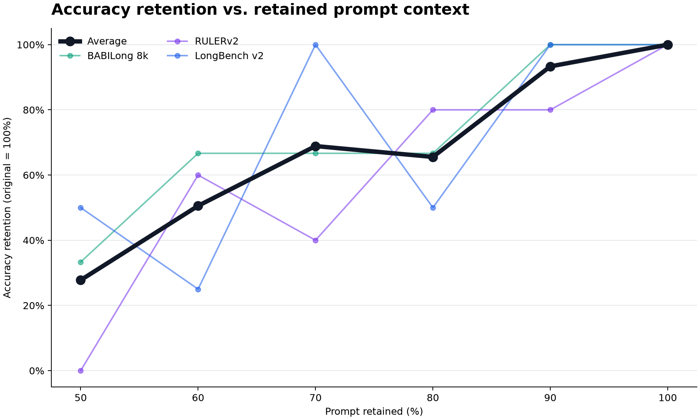
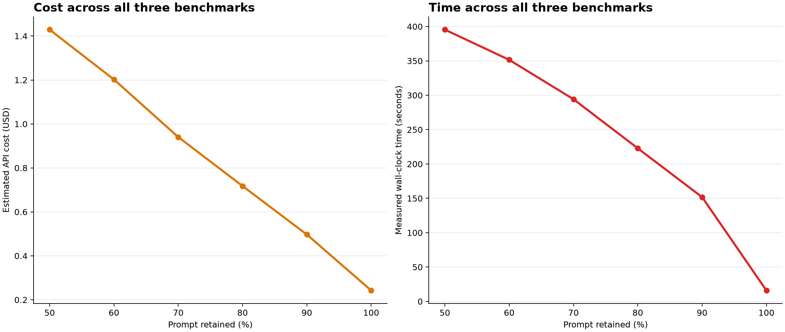
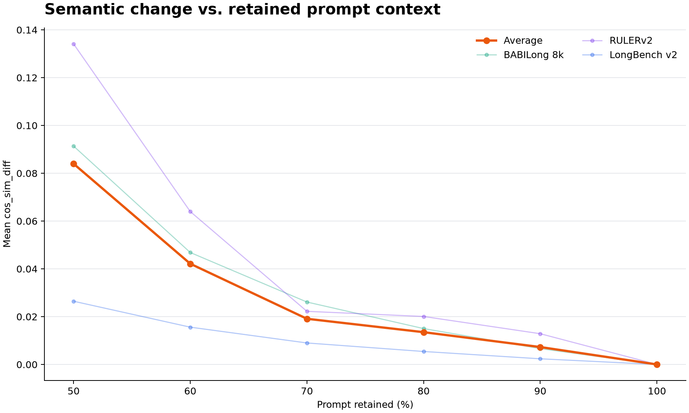
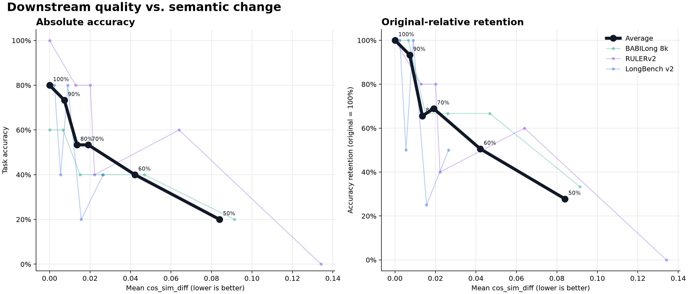

# Alexandria

[](https://github.com/ucsc-cse115a-alexandria/alexandria/tree/python-coverage-comment-action-data)

Label-free prompt optimization: shorten instruction-heavy prompts while preserving their meaning,
using sentence embeddings. Alexandria finds which instructions overlap (a redundancy score) and
merges each near-duplicate pair into a single rewritten sentence — instead of dropping instructions,
an LLM fuses their intent — no labels, no training, no target output to compare against.

See [the design specification](docs/spec.md) for the implementation architecture.

## Install

Requires Python 3.14 and [uv](https://docs.astral.sh/uv/).

```bash
uv sync
```

## Setup

Alexandria uses OpenAI for embeddings (`text-embedding-3-small`) and merging (`gpt-5.6-luna`), so it
needs an API key. Store it once:

```bash
uv run alexandria config set openai-api-key
```

This prompts with hidden input and saves the key to `~/.config/alexandria/config.toml` (owner-only,
XDG-aware). You can instead `export OPENAI_API_KEY=...`. Resolution order is explicit argument, then
`OPENAI_API_KEY`, then the config file. Without a key, commands fail before any work with:

```text
OpenAI API key not found. Set it with `alexandria config set openai-api-key` or export OPENAI_API_KEY.
```

## CLI

Run the full optimization pipeline with one command:

```bash
uv run alexandria reduce prompt.txt > reduced.txt
```

Use `--save-tokens N` to stop once N tokens are saved and `--cos-sim-diff-budget` to cap the cumulative
whole-document `cos_sim_diff` (`1 - cosine_similarity`) the reduction may accept (default: `0.5`):

```bash
uv run alexandria reduce prompt.txt --save-tokens 200 > reduced.txt
```

Use `--target-reduction P` when the reduction percentage is a requirement rather than a best-effort
budget. The returned prompt is always at or below the derived token ceiling. The command fails before
calling the merge model only when protected Markdown/XML structure alone cannot fit:

```bash
uv run alexandria reduce prompt.txt --target-reduction 10 > reduced.txt
```

Strict targets keep Markdown/XML boundaries fixed and, for each content group, fire three generation requests in
parallel with different rewrite strategies (plain compression, extractive deletion, and dense paraphrase), each
capped so a completed response fits the token budget. Alexandria checks every candidate with `cl100k_base` and
deterministically repairs any overshoot. Among the structure-valid candidates within the token ceiling it selects
the one with the lowest whole-prompt `cos_sim_diff`, breaking ties by coverage. Undershooting the target is acceptable: the
guarantee is at most the requested token count. When no candidate meets the `cos_sim_diff` budget, the best target-safe
result is returned and `merge_metrics.cos_sim_diff_budget_met` is `false`. `--json` also reports final `cos_sim_diff`, repaired tokens, calls, and retries.
Exact duplicate text in best-effort reduction is still removed without a merge-model call. Text mode prints call
and retry counts to stderr. Add `-v`/`--verbose` to stream automatic-reduction progress live to stderr instead of
waiting for the final summary.

`report` runs the full optimization and always emits machine-readable JSON with token metrics and
quality scores:

```bash
uv run alexandria report prompt.txt --cos-sim-diff-budget 2.0
```

The `tokens` object reports source, reduced, and saved tokens. The `quality` object reports the
token-weighted mean and minimum best-match cosine similarity for every source instruction. To fail
when a report is worse than a committed baseline, pass the baseline file:

```bash
uv run alexandria report benchmarks/optimization_prompt.txt \
  --cos-sim-diff-budget 2.0 \
  --baseline benchmarks/optimization_baseline.json
```

The command exits with status 1 when reduced token count rises or either monitored quality score
falls beyond its tolerance. Use `--token-tolerance` and `--quality-tolerance` for expected numerical
variation. Regenerate the baseline manually (it needs an API key and is not committed by CI):

```bash
uv run alexandria report benchmarks/optimization_prompt.txt > benchmarks/optimization_baseline.json
```

For phase-by-phase execution, saving and resuming JSON envelopes, and the full option reference, see
[the CLI guide](docs/cli.md).

## Library

The CLI is a thin wrapper; everything is importable. Call `reduce` directly from Python (it builds the
OpenAI defaults, so a key must be resolvable — pass `api_key=`, export `OPENAI_API_KEY`, or use a
`.env` file):

```python
import alexandria

result = alexandria.reduce("Be concise.\nBe concise.\nUse examples.\n")
print(result.text)
```

See [the library guide](docs/library.md) for injecting your own embedder and merger for offline tests,
direct phase composition, and a runnable example in `examples/reduce_prompt.py`.

## Benchmark

The current cross-benchmark result is a five-case smoke test of the publication pipeline across
BABILong 8k, RULERv2, and LongBench v2 (seed 42, `gpt-5.6-luna` for compression and answers,
`text-embedding-3-small`). With only five paired cases per benchmark, one answer moves accuracy by
20 percentage points — these curves are exploratory, not release evidence.

| Prompt retained | Average accuracy | Average accuracy retention | Achieved token reduction | Total wall time | Estimated API cost |
|---:|---:|---:|---:|---:|---:|
| 50% | 20.0% | 27.8% | 56.9% | 395.5s | $1.4291 |
| 60% | 40.0% | 50.6% | 45.8% | 351.5s | $1.2022 |
| 70% | 53.3% | 68.9% | 33.1% | 294.2s | $0.9405 |
| 80% | 53.3% | 65.6% | 23.4% | 222.8s | $0.7176 |
| 90% | 73.3% | 93.3% | 12.4% | 151.8s | $0.4969 |
| 100% (original) | 80.0% | 100.0% | 0.0% | 15.9s | $0.2425 |

`Accuracy retention` divides each benchmark's compressed accuracy by its original accuracy before
averaging equally across the three benchmarks. In this smoke, retaining 90% of the prompt saved
12.4% of tokens while keeping 93.3% average accuracy retention; below 70% retained, accuracy
degrades quickly.





`cos_sim_diff` (`1 - cosine_similarity` between the original and reduced whole-prompt embeddings)
is the quality knob the CLI exposes as `--cos-sim-diff-budget`. The next two figures connect it to
both sides of the trade-off — how much semantic change each retention level introduces, and how
accuracy falls as semantic change grows — so you can pick a budget instead of guessing:





The raw per-benchmark accuracy figure, cost assumptions and planning estimates, per-benchmark
pass/fail decisions, exact commands, and links to the append-only raw records are in the
[shared benchmark documentation](benchmarks/prompt_compression/README.md).

## How it works

Four pure phases over one intermediate representation (`Document` → `Section` → `Sentence`):

1. **Represent** — split the prompt into instructions, tokenize, and embed each one.
2. **Score** — rate each instruction's redundancy (its cosine similarity to the most similar other).
3. **Optimize** — for each near-duplicate pair the LLM rewrites both sentences as one minimal-token
   sentence, kept at the first occurrence (the second is removed). Every rewrite is checked by
   applying it and measuring the whole-document `cos_sim_diff`; if it exceeds the `cos_sim_diff` budget the
   LLM is re-asked with feedback, up to 3 attempts, then the pair is skipped.
4. **Select** — apply accepted edits in ascending `cos_sim_diff` order under the cumulative budget, stopping
   at the requested token budget. `--target-reduction` uses a hard-target path that repairs model overshoot
   deterministically and reports whether the resulting prompt also met the `cos_sim_diff` budget.

## Tech stack

Python 3.14 · Pydantic (the validated IR) · openai · NumPy · tiktoken · click.

## Development

```bash
uv run pytest        # tests + coverage
uv run ruff check .  # lint
uv run pyright       # types
```
