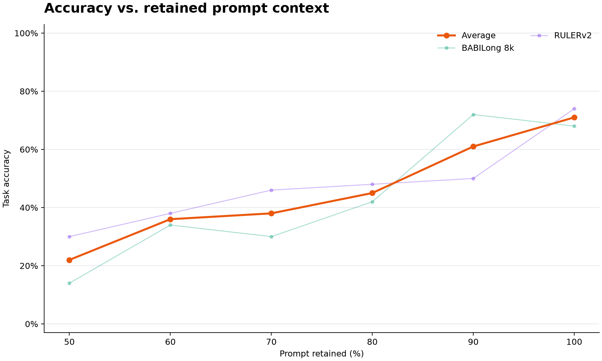
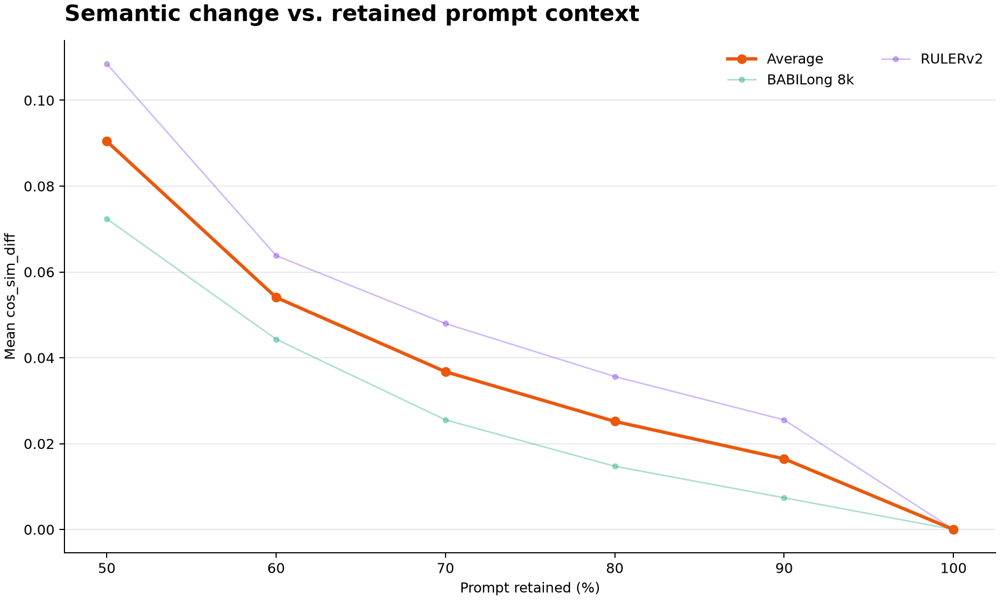
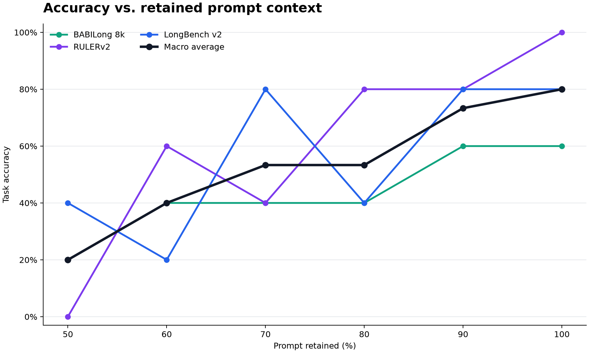

# Shared prompt-compression benchmark runner

This package provides one evidence format for BABILong 8k, RULERv2, and LongBench v2. These benchmarks were chosen because each case is a large, static text request with an automatic answer metric. The same case can therefore be sent unchanged and with only its long context compressed, producing a direct paired accuracy comparison. Agent-environment benchmarks such as SWE-bench and OSWorld are intentionally outside this interface because their observations and trajectories change during execution and cannot be represented as one controlled original-versus-compressed prompt pair.

## Experimental unit and compression boundary

Every adapter turns an upstream dataset row into three lossless prompt parts:

```text
fixed prefix + compressible long context + fixed suffix
```

`original` sends their exact concatenation. Each requested reduction compresses only the context, reconstructs the complete prompt, and enforces a hard full-prompt token ceiling. For example, `--reductions 50 25 10 5` creates `keep50`, `keep75`, `keep90`, and `keep95`. The instruction, query, answer choices, required output format, and structural delimiters remain fixed where the upstream benchmark provides them.

Adapters also supply the benchmark-specific expected answer and verifier. The common runner never asks a model to grade another model. It records both the benchmark score (which may include partial credit) and strict case correctness.

## Run interface

Use the same command shape for all three benchmarks:

```bash
uv run python -m scripts.prompt_compression_benchmark \
  --benchmark babilong_8k \
  --n 5 --seed 42 --reductions 50 40 30 20 10 \
  --out trial_results/babilong_8k/smoke --dry-run
```

Replace the benchmark name with `ruler_v2` or `longbench_v2`, provide `--data-dir` when needed, and remove `--dry-run` to make model calls. A smoke run can use `--n 5`; a release-oriented run can use `--n 100`. `--min-source-tokens` and `--max-source-tokens` constrain eligibility using the actual complete prompt counted with `cl100k_base`, so a run can explicitly require long inputs and remain within the answer model's context window.

The runner completes every `original` response first. It proceeds to compression only when original accuracy is at
least `--min-original-accuracy` (default 0.50). This prevents a cheap but incapable answer model from producing a
misleading retention curve. `--model` selects the answer model and `--merge-model` independently selects the
compression model; both are recorded in the manifest. The paired retention calculation always compares conditions
answered by the same answer model.

Sampling is deterministic for a fixed eligible dataset, `n`, and seed. It round-robins across task labels before taking additional cases from a task, avoiding a small sample that accidentally contains only one task family.

## 50-case multi-retention evidence run

The current run uses seed 42, `gpt-5.6-luna` with reasoning `none` for both answers and merge rewrites, and
`text-embedding-3-small` for compression and whole-prompt comparison. It samples 50 cases per benchmark and
requests full-prompt retained targets of 50%, 60%, 70%, 80%, and 90%. BABILong and RULERv2 use their complete
prepared datasets. LongBench uses the pinned official `length=short` subset and a 128,000-token complete-prompt
ceiling. Exact selected case IDs and prompt-length distributions are in each manifest.

The original-first gate produced an important qualification result: BABILong scored 68% and RULERv2 scored 74%,
so both proceeded through all 250 compressed cases. LongBench scored 48% (24/50), below the predeclared 50%
minimum, so the runner stopped before spending on compression. LongBench is retained as original-only evidence
and is excluded from compressed curves and their Average.

| Benchmark | Original | keep50 | keep60 | keep70 | keep80 | keep90 | Baseline gate |
|---|---:|---:|---:|---:|---:|---:|---|
| BABILong 8k | 68% | 14% | 34% | 30% | 42% | 72% | PASS |
| RULERv2 | 74% | 30% | 38% | 46% | 48% | 50% | PASS |
| LongBench v2 | 48% | — | — | — | — | — | FAIL; compression not run |

At keep90, BABILong retained 105.9% of original accuracy with a paired 95% bootstrap interval of
84.6%–133.3%; RULERv2 retained 67.6% with an interval of 50.0%–85.7%. Both decisions are **FAIL** because the
lower interval endpoint is below the 90% release threshold. Every other compressed condition also failed on both
qualified benchmarks.

Across BABILong and RULERv2, keep90 averaged 61.0% task accuracy versus 71.0% original accuracy, 86.7% accuracy
retention, 13.5% achieved token reduction, and `cos_sim_diff` 0.016461. The complete attempt, including
LongBench's original-only gate, contains 650 records and 4,996 metered usage events. It cost an estimated $27.2084
and accumulated 7,631.6 seconds of measured reduction-plus-answer time. Costs use the manifest's standard
short-context prices per million tokens: $1.00 Luna input, $0.10 cached input, $6.00 output, and $0.02 embedding
input. These are metered estimates, not invoice totals.

The cross-benchmark graphs treat `Average` as the equal-weight mean of the two qualified benchmarks. LongBench is
omitted from the user-facing curves because it has no corresponding compressed observations; its original-only
result remains in the raw aggregate metadata and its benchmark-specific documentation.





Reproduce the exact run after preparing the pinned datasets:

```bash
uv run python -m scripts.download_babilong_8k_data
uv run python -m scripts.download_longbench_v2_data

uv run python -m scripts.prompt_compression_benchmark \
  --benchmark babilong_8k --n 50 --seed 42 --reductions 50 40 30 20 10 \
  --model gpt-5.6-luna --merge-model gpt-5.6-luna --min-original-accuracy 0.50 \
  --out benchmarks/babilong_8k/results/2026-07-19-luna-keep50-90-n50-v1

uv run python -m scripts.prompt_compression_benchmark \
  --benchmark ruler_v2 --n 50 --seed 42 --reductions 50 40 30 20 10 \
  --data-dir data/ruler_v2 \
  --model gpt-5.6-luna --merge-model gpt-5.6-luna --min-original-accuracy 0.50 \
  --out benchmarks/ruler_v2/results/2026-07-19-luna-keep50-90-n50-v1

uv run python -m scripts.prompt_compression_benchmark \
  --benchmark longbench_v2 --n 50 --seed 42 --reductions 50 40 30 20 10 \
  --data-dir data/longbench_v2/short.json --max-source-tokens 128000 \
  --model gpt-5.6-luna --merge-model gpt-5.6-luna --min-original-accuracy 0.50 \
  --out benchmarks/longbench_v2/results/2026-07-19-luna-keep50-90-short-n50-v1

uv run python -m scripts.plot_prompt_compression_benchmarks \
  benchmarks/babilong_8k/results/2026-07-19-luna-keep50-90-n50-v1 \
  benchmarks/ruler_v2/results/2026-07-19-luna-keep50-90-n50-v1 \
  benchmarks/longbench_v2/results/2026-07-19-luna-keep50-90-short-n50-v1 \
  --out-dir benchmarks/prompt_compression/results/2026-07-19-luna-keep50-90-n50-v1
```

The LongBench command intentionally exits non-zero after writing its original-only summary because its baseline
does not qualify. Two transient TLS timeouts interrupted the longer qualified runs; rerunning the identical
commands skipped completed case/condition keys and finished without duplicate records. The concatenated console
logs preserve both the timeout traces and successful resumes.

Raw evidence:

- [BABILong 8k run](../babilong_8k/results/2026-07-19-luna-keep50-90-n50-v1/)
- [RULERv2 run](../ruler_v2/results/2026-07-19-luna-keep50-90-n50-v1/)
- [LongBench v2 original-only run](../longbench_v2/results/2026-07-19-luna-keep50-90-short-n50-v1/)
- [Cross-benchmark aggregates and figures](results/2026-07-19-luna-keep50-90-n50-v1/), including machine-readable
  [`aggregate_summary.json`](results/2026-07-19-luna-keep50-90-n50-v1/aggregate_summary.json)

## Archived five-case multi-retention smoke

The committed smoke uses seed 42, Luna for compression and answers, reasoning `none`, five cases per benchmark,
and full-prompt retained targets of 50%, 60%, 70%, 80%, and 90%. BABILong and RULERv2 use their complete prepared
datasets. LongBench uses the pinned official `length=short` rows and an additional 128,000-token complete-prompt
ceiling. The selected original prompts averaged 7,686, 6,391, and 39,710 tokens respectively.

Original accuracy was 60% for BABILong, 100% for RULERv2, and 80% for LongBench, so all three passed the 50%
baseline gate. Across benchmarks, average accuracy rose from 20.0% at keep50 to 73.3% at keep90, versus 80.0% on
original prompts. Average accuracy retention at keep90 was 93.3%, with a mean whole-prompt `cos_sim_diff` of
0.007288 and an achieved 12.4% token reduction. The entire 90-condition run cost an estimated $5.0288 and took
1,431.7 seconds of measured sequential wall time. The manifests use standard short-context Luna prices per million
tokens: $1.00 input, $0.10 cached input, and $6.00 output, plus $0.02 embedding input. Scaling the selected n=100
source-token distributions by this smoke's measured per-token cost gives a planning estimate of $91.54; allow
roughly $140 for run-to-run variation in merge work. This is an estimate, not a spend claim.

`Average` is the equal-weight mean of the three benchmark-level values. Accuracy retention is computed per
benchmark as compressed accuracy divided by original accuracy and then averaged; it is not another name for task
accuracy.

The project README shows the accuracy-retention, cost/time, `cos_sim_diff`, and semantic-change trade-off curves.
`semantic_change_vs_accuracy.png` directly plots task accuracy and original-relative accuracy retention against
mean whole-prompt `cos_sim_diff`, making the quality trade-off visible without treating retained token percentage
as a proxy for semantic preservation. The remaining figure below plots raw per-benchmark task accuracy — the
fraction of cases answered correctly under a condition:



These are smoke-test numbers: with five cases per benchmark, accuracy moves in 20-point steps. All BABILong and
RULERv2 compressed conditions failed the paired-bootstrap release rule. LongBench keep70 and keep90 passed, but
those n=5 decisions are not release claims. Use n=100 for the evidence run.

Reproduce the exact smoke after preparing the pinned datasets:

```bash
uv run python -m scripts.download_babilong_8k_data
uv run python -m scripts.download_longbench_v2_data

uv run python -m scripts.prompt_compression_benchmark \
  --benchmark babilong_8k --n 5 --seed 42 --reductions 50 40 30 20 10 \
  --model gpt-5.6-luna --merge-model gpt-5.6-luna --min-original-accuracy 0.50 \
  --out benchmarks/babilong_8k/results/2026-07-18-luna-keep50-90-n5-v1

uv run python -m scripts.prompt_compression_benchmark \
  --benchmark ruler_v2 --n 5 --seed 42 --reductions 50 40 30 20 10 \
  --data-dir data/ruler_v2 \
  --model gpt-5.6-luna --merge-model gpt-5.6-luna --min-original-accuracy 0.50 \
  --out benchmarks/ruler_v2/results/2026-07-18-luna-keep50-90-n5-v1

uv run python -m scripts.prompt_compression_benchmark \
  --benchmark longbench_v2 --n 5 --seed 42 --reductions 50 40 30 20 10 \
  --data-dir data/longbench_v2/short.json --max-source-tokens 128000 \
  --model gpt-5.6-luna --merge-model gpt-5.6-luna --min-original-accuracy 0.50 \
  --out benchmarks/longbench_v2/results/2026-07-18-luna-keep50-90-short-n5-v1

uv run python -m scripts.plot_prompt_compression_benchmarks \
  benchmarks/babilong_8k/results/2026-07-18-luna-keep50-90-n5-v1 \
  benchmarks/ruler_v2/results/2026-07-18-luna-keep50-90-n5-v1 \
  benchmarks/longbench_v2/results/2026-07-18-luna-keep50-90-short-n5-v1 \
  --out-dir benchmarks/prompt_compression/results/2026-07-18-luna-keep50-90-n5-v1
```

Raw evidence:

- [BABILong 8k run](../babilong_8k/results/2026-07-18-luna-keep50-90-n5-v1/)
- [RULERv2 run](../ruler_v2/results/2026-07-18-luna-keep50-90-n5-v1/)
- [LongBench v2 run](../longbench_v2/results/2026-07-18-luna-keep50-90-short-n5-v1/)
- [Cross-benchmark aggregates and figures](results/2026-07-18-luna-keep50-90-n5-v1/), including machine-readable
  [`aggregate_summary.json`](results/2026-07-18-luna-keep50-90-n5-v1/aggregate_summary.json)

The previously published 100-case BABILong keep90 result remains available in the
[BABILong benchmark README](../babilong_8k/README.md); its release decision is **FAIL**.

As a negative control for model selection, `gpt-5.4-nano` was also tried as the answer model with Luna compression.
Its original accuracy was 20% on BABILong and 40% on LongBench, so the gate correctly stopped those runs before
compression. RULERv2 reached 80% and proceeded. These results show why answer-model baseline qualification is
required; they are not mixed into the Luna curves.

## Measured 10-case keep90 pilots

The following runs compare `original` with a full-prompt target of at most 90% of the original `cl100k_base` token count. They use seed 42, `gpt-5.6-luna` with reasoning `none` for answers and merge rewrites, and `text-embedding-3-small` for compression and whole-prompt comparison. The achieved reductions can exceed 10% because Alexandria applies complete rewrites or deletions and does not pad a shorter valid result.

`Cosine diff` is `1 - cosine_similarity` between chunk-pooled embeddings of the complete model-visible original and compressed prompts. Original is zero by definition. Execution measures only the answer-model call after the prompt is ready, making original and keep90 directly comparable. Reduction is reported separately and covers compression plus the whole-prompt cosine measurement. Costs use every metered call in the corresponding phase at the pricing recorded in each manifest.

| Benchmark | Original input range | Mean tokens, original → keep90 | Reduction | Mean cosine diff | Accuracy, original → keep90 | Execution time, original → keep90 | Execution cost, original → keep90 | Reduction time | Reduction cost |
|---|---:|---:|---:|---:|---:|---:|---:|---:|---:|
| BABILong 8k | 7,251–7,883 | 7,668.5 → 6,634.2 | 13.49% | 0.006987 | 60% → 60% | 11.5s → 9.2s | $0.0768 → $0.0665 | 94.8s | $0.2166 |
| RULERv2 | 4,149–8,139 | 6,092.4 → 5,214.5 | 14.41% | 0.023584 | 70% → 50% | 14.6s → 14.9s | $0.0715 → $0.0624 | 68.6s | $0.1482 |
| LongBench v2 | 22,676–123,954 | 68,824.7 → 61,042.0 | 11.31% | 0.009065 | 60% → 60% | 14.8s → 12.6s | $0.6371 → $0.6021 | 290.0s | $0.2925 |

Across the three pilots, reduction took 453.5 seconds and cost an estimated $0.6573. The original and compressed executions together took 77.5 seconds and cost $1.5164. These are pipeline-validation pilots, not release-strength estimates: each benchmark has only ten paired cases. Detailed assumptions, commands, caveats, and evidence links are in the benchmark-specific READMEs.

## Evidence written for every run

The output directory is resumable and contains:

- `manifest.json`: implementation commit, pinned dataset/prompt provenance, selected case IDs, model settings, eligibility filters, reductions, complete-prompt token distribution, and cost assumptions;
- `records.jsonl`: append-only per-case and per-condition responses, parsed verdicts, prompt hashes, source/target/sent tokens, whole-prompt embedding cosine difference, reduction and execution latency, merge metrics, API usage, and estimated cost;
- `prompts.jsonl.gz`: the exact model-visible original and compressed prompts, keyed by case and condition;
- `summary.json`: aggregate and per-task accuracy, benchmark score, token reduction, separately reported execution and reduction time/cost, paired transitions, bootstrap intervals, and the release decision; and
- `report.md`: a compact original-versus-compressed evidence table and a plain PASS or FAIL statement; and
- `run.log` for committed evidence runs: console progress, baseline-gate output, interruption traces, resume output,
  and the final rendered report.

A completed `(case ID, condition)` pair is skipped on rerun, so interruption does not require repeating paid calls. The prompt SHA-256 in `records.jsonl` is checked against the exact prompt before it is appended.

## Accuracy retention and release rule

Conditions are paired by case ID. The summary resamples case indices with replacement, preserving the original/compressed pairing, and calculates compressed accuracy divided by original accuracy for each resample. The default 10,000-sample percentile interval uses seed 42 and the 2.5th and 97.5th percentiles. Resamples whose original accuracy is zero are excluded because their retention ratio is undefined.

The default release threshold is 90% accuracy retention. A condition passes only when the lower endpoint of its 95% paired-bootstrap interval is at least 90%; a point estimate above 90% is not sufficient. Original accuracy, compressed accuracy, score change, all four paired outcome transitions, assumptions, and the decision are retained so readers can see when low baseline solvability or a small sample makes retention unstable.

Recompute the summary entirely from saved raw outcomes, without API calls:

```bash
uv run python -m scripts.summarize_prompt_compression_benchmark \
  trial_results/babilong_8k/smoke \
  --release-threshold 0.90 --bootstrap-samples 10000 --bootstrap-seed 42
```

The benchmark-specific READMEs explain the upstream input, metric, preparation, and limitations:

- [`../babilong_8k/README.md`](../babilong_8k/README.md)
- [`../ruler_v2/README.md`](../ruler_v2/README.md)
- [`../longbench_v2/README.md`](../longbench_v2/README.md)
