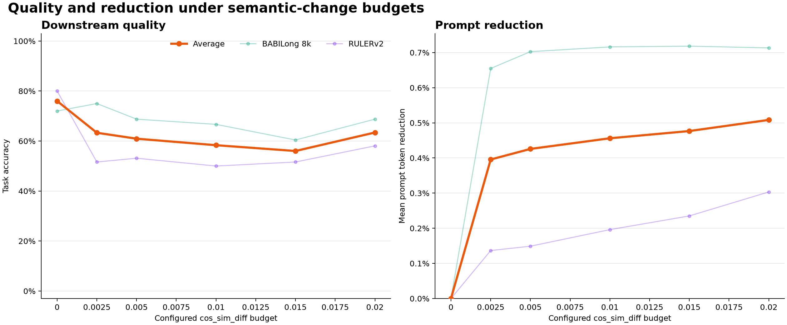
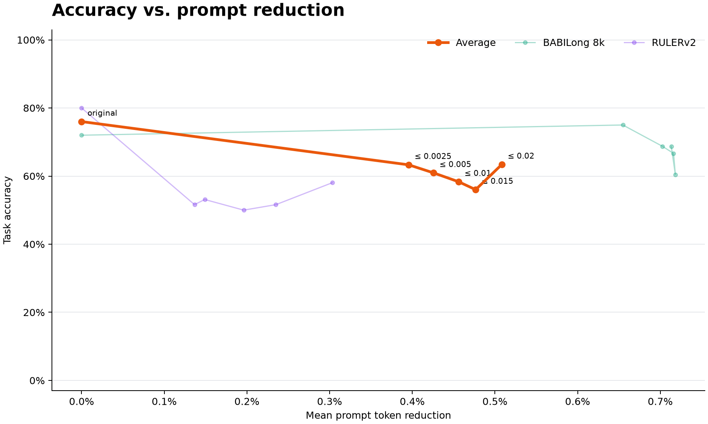
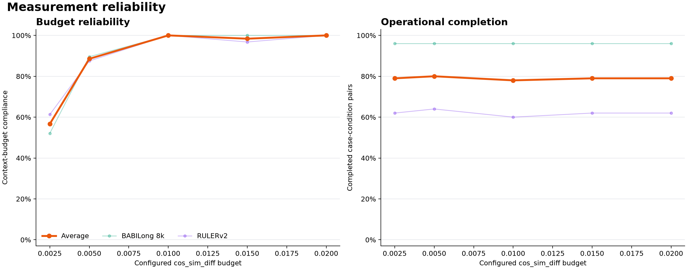
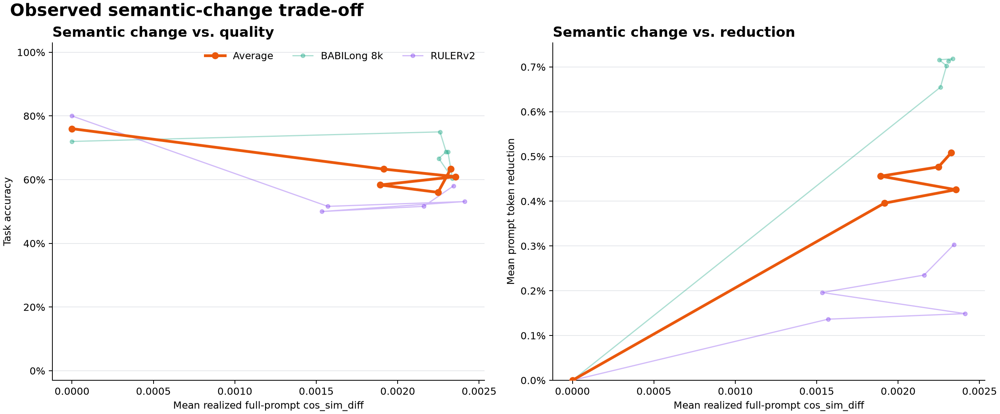

# Semantic-budget benchmark report: Luna, n=50

This report contains the complete experimental assumptions, paired results, reliability checks, timing and cost,
reproduction commands, and raw-evidence links behind the concise project README summary.

## Setup

- Date: 2026-07-19
- Benchmarks: BABILong 8k and RULERv2
- Sample: 50 deterministically selected cases per benchmark, seed 42
- Answer and compression model: `gpt-5.6-luna`, answer reasoning `none`
- Embedding model: `text-embedding-3-small`
- Configured context `cos_sim_diff` budgets: 0.0025, 0.005, 0.01, 0.015, and 0.02
- Compression mode: best effort, `require_target=False`, with a 50%-retained safety floor
- Safety limits: 30 generation calls and 300 elapsed seconds per case-condition
- Original eligibility gate: at least 50% task accuracy
- Bootstrap: 10,000 paired resamples, seed 42, 95% percentile interval

The two original baselines qualified before compression began: BABILong 8k scored 72.0% (36/50) and RULERv2
scored 80.0% strict accuracy (40/50), with an 84.5% official mean score.

## Aggregate result

`Average` is the equal-weight mean of BABILong 8k and RULERv2. Accuracy is calculated over completed records;
`Complete` exposes the mean fraction of the 50 selected cases that produced a record, so missing outcomes are not
silently imputed.

| Configured budget | Average accuracy | BABILong 8k | RULERv2 | Mean token reduction | Mean full-prompt `cos_sim_diff` | Complete | Budget compliance |
|---:|---:|---:|---:|---:|---:|---:|---:|
| Original | 76.0% | 72.0% (50/50) | 80.0% (50/50) | 0.00% | 0.000000 | 100.0% | 100.0% |
| 0.0025 | 63.3% | 75.0% (48/50) | 51.6% (31/50) | 0.40% | 0.001915 | 79.0% | 56.7% |
| 0.005 | 60.9% | 68.8% (48/50) | 53.1% (32/50) | 0.43% | 0.002354 | 80.0% | 88.5% |
| 0.01 | 58.3% | 66.7% (48/50) | 50.0% (30/50) | 0.46% | 0.001893 | 78.0% | 100.0% |
| 0.015 | 56.0% | 60.4% (48/50) | 51.6% (31/50) | 0.48% | 0.002248 | 79.0% | 98.4% |
| 0.02 | 63.4% | 68.8% (48/50) | 58.1% (31/50) | 0.51% | 0.002326 | 79.0% | 100.0% |





## Paired measurements

The paired denominator is the completed case set for that condition. The original accuracy shown here is the
accuracy of those same matched cases, which can differ from the 50-case baseline.

### BABILong 8k

| Budget | Complete | Accuracy | Accuracy retention (95% CI) | Token reduction | Compliance |
|---:|---:|---:|---:|---:|---:|
| 0.0025 | 48/50 | 75.0% | 105.9% (88.9%–127.6%) | 0.65% | 52.1% |
| 0.005 | 48/50 | 68.8% | 97.1% (80.0%–118.5%) | 0.70% | 89.6% |
| 0.01 | 48/50 | 66.7% | 94.1% (78.9%–111.8%) | 0.72% | 100.0% |
| 0.015 | 48/50 | 60.4% | 85.3% (69.2%–102.9%) | 0.72% | 100.0% |
| 0.02 | 48/50 | 68.8% | 97.1% (81.1%–116.1%) | 0.71% | 100.0% |

### RULERv2

| Budget | Complete | Strict accuracy | Accuracy retention (95% CI) | Token reduction | Compliance |
|---:|---:|---:|---:|---:|---:|
| 0.0025 | 31/50 | 51.6% | 76.2% (56.5%–93.8%) | 0.14% | 61.3% |
| 0.005 | 32/50 | 53.1% | 77.3% (56.0%–100.0%) | 0.15% | 87.5% |
| 0.01 | 30/50 | 50.0% | 75.0% (55.0%–93.8%) | 0.20% | 100.0% |
| 0.015 | 31/50 | 51.6% | 76.2% (56.5%–94.4%) | 0.24% | 96.8% |
| 0.02 | 31/50 | 58.1% | 85.7% (63.6%–110.5%) | 0.30% | 100.0% |

## Reliability and operational outcomes



BABILong produced 290 unique records and 10 terminal outcomes, accounting for all 300 selected
case-condition pairs. Each budget completed 48/50 cases. RULERv2 produced 205 unique records and 95 terminal
outcomes, also accounting for all 300 pairs. Its terminal outcomes were concentrated by task family:

| RULERv2 task | Terminal outcomes |
|---|---:|
| `mv_niah_basic` | 20 |
| `qa_basic` | 19 |
| `qa_easy` | 16 |
| `qa_hard` | 20 |
| `qa_medium` | 20 |

All terminal outcomes were caused by the preregistered 30-generation or 300-second safety limits. The API event
logs contain no API-error events. A completed result can still be noncompliant: final context embeddings were
remeasured after compression, and that measured value is the source of the compliance percentages above.

## Observed semantic-change trade-off



The figures connect each measured final prompt to downstream accuracy without smoothing.

## Time and cost

The request-level event logs contain 20,530 events and an estimated n=50 run cost of **$7.1707**. This includes
requests made by terminal conditions and requests preserved before a runner interruption; successful records
alone contain $5.0364 of estimated usage. The two n=1 paid preflights cost another $0.1036, for **$7.2742** total
paid work associated with this experiment. These are metered estimates from the manifest pricing snapshot, not
invoice totals.

| Benchmark | API events | Request-level cost | Completed-pair time | Terminal-condition time | Event window |
|---|---:|---:|---:|---:|---:|
| BABILong 8k | 9,049 | $3.5654 | 7,834.3s | 893.6s | 2h 47m 27s |
| RULERv2 | 11,481 | $3.6053 | 2,949.5s | 7,971.9s | 3h 16m 51s |
| Total | 20,530 | $7.1707 | 10,783.8s | 8,865.5s | 3h 16m 53s parallel window |

The condition times sum measured elapsed work and therefore exceed the end-to-end window because the two
benchmark runners executed concurrently. The event window includes two detected runner-session interruptions and
their resume delay.

## Reproduction

Prepare the pinned datasets described by the benchmark-specific guides, then run:

```bash
uv run python -m scripts.prompt_compression_benchmark \
  --benchmark babilong_8k --n 50 --seed 42 \
  --cos-sim-diff-budgets 0.0025 0.005 0.01 0.015 0.02 \
  --minimum-retained-percent 50 \
  --max-generation-calls-per-condition 30 --max-condition-seconds 300 \
  --max-estimated-cost-usd 5 \
  --data-dir data/babilong/8k \
  --model gpt-5.6-luna --merge-model gpt-5.6-luna \
  --out benchmarks/babilong_8k/results/2026-07-19-luna-cos-budget-n50-v1

uv run python -m scripts.prompt_compression_benchmark \
  --benchmark ruler_v2 --n 50 --seed 42 \
  --cos-sim-diff-budgets 0.0025 0.005 0.01 0.015 0.02 \
  --minimum-retained-percent 50 \
  --max-generation-calls-per-condition 30 --max-condition-seconds 300 \
  --max-estimated-cost-usd 20 \
  --data-dir data/ruler_v2 \
  --model gpt-5.6-luna --merge-model gpt-5.6-luna \
  --out benchmarks/ruler_v2/results/2026-07-19-luna-cos-budget-n50-v1

uv run python -m scripts.plot_cos_sim_budget_benchmarks \
  benchmarks/babilong_8k/results/2026-07-19-luna-cos-budget-n50-v1 \
  benchmarks/ruler_v2/results/2026-07-19-luna-cos-budget-n50-v1 \
  --out-dir benchmarks/prompt_compression/results/2026-07-19-luna-cos-budget-n50-v1
```

The run directories are resumable. Completed and terminal case-condition keys are skipped, while a condition
interrupted before its record or terminal checkpoint is evaluated again. Two runner sessions stopped updating
during this experiment; the identical commands resumed from their append-only checkpoints. Record identities are
unique after resume.

Both manifests name implementation commit `3d5b9b969d36741be10c67ff4c292d41595021c5`. Their
`implementation_dirty` value is `true` because `tee -a run.log` opened the untracked output file before the Python
process recorded Git status; the BABILong worktree also contained an unrelated untracked `icon.png`. The tracked
implementation matched the named commit. The raw manifests are preserved without post-run alteration.

## Raw evidence

- [BABILong 8k run](../../../babilong_8k/results/2026-07-19-luna-cos-budget-n50-v1/)
- [RULERv2 run](../../../ruler_v2/results/2026-07-19-luna-cos-budget-n50-v1/)
- [Machine-readable aggregate](aggregate_summary.json)
- [Runner and evidence-format guide](../../README.md)

Each benchmark directory contains `manifest.json`, append-only `records.jsonl`, exact prompts in
`prompts.jsonl.gz`, `api_events.jsonl`, `errors.jsonl`, `run.log`, `summary.json`, and a benchmark-specific
`report.md`.

## Caveats

- Accuracy at each compressed condition uses only its completed paired cases; terminal outcomes can make the
  completed subset differ across conditions.
- The final compliance check is a measured property. A configured budget is not a guarantee that every returned
  prompt will remain under that value.
- `cos_sim_diff` is an embedding diagnostic, not proof that all task-relevant facts survived.
- Each case-condition has one stochastic model observation. The paired bootstrap describes sampled-case
  uncertainty, not repeat-generation variance.
- These static benchmarks do not cover interactive or stateful agent environments.
