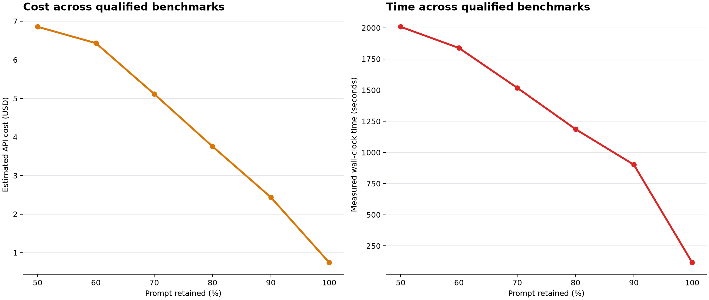

# Prompt-compression benchmark report: Luna, n=50

This is the detailed report behind the concise adoption summary in the project README. It preserves the complete
experimental assumptions, every tested condition, auxiliary figures, reproduction commands, costs, timing, and
links to raw evidence.

## Setup

- Date: 2026-07-19
- Sample: 50 cases per benchmark, seed 42
- Answer and compression model: `gpt-5.6-luna`, reasoning `none`
- Embedding model: `text-embedding-3-small`
- Retained-prompt targets: 50%, 60%, 70%, 80%, 90%, plus uncompressed original
- Original eligibility gate: at least 50% task accuracy
- Bootstrap: 10,000 paired resamples, seed 42

BABILong 8k and RULERv2 used their complete prepared datasets. LongBench v2 used the pinned official
`length=short` subset with a 128,000-token complete-prompt ceiling.

## Aggregate results

`Average` is the equal-weight mean of BABILong 8k and RULERv2. Accuracy retention is calculated relative to each
benchmark's own original accuracy before averaging.

| Prompt retained | Average accuracy | Accuracy retention | Achieved token reduction | Mean `cos_sim_diff` | Measured time |
|---:|---:|---:|---:|---:|---:|
| 50% | 22.0% | 30.6% | 58.2% | 0.090447 | 2,008.4s |
| 60% | 36.0% | 50.7% | 45.3% | 0.054069 | 1,838.2s |
| 70% | 38.0% | 53.1% | 34.5% | 0.036756 | 1,518.4s |
| 80% | 45.0% | 63.3% | 23.9% | 0.025185 | 1,186.8s |
| 90% | 61.0% | 86.7% | 13.5% | 0.016461 | 901.5s |
| 100% (original) | 71.0% | 100.0% | 0.0% | 0.000000 | 116.8s |

| Benchmark | Original | keep50 | keep60 | keep70 | keep80 | keep90 |
|---|---:|---:|---:|---:|---:|---:|
| BABILong 8k | 68% | 14% | 34% | 30% | 42% | 72% |
| RULERv2 | 74% | 30% | 38% | 46% | 48% | 50% |

At keep90, BABILong retained 105.9% of original accuracy with a paired 95% interval of 84.6%–133.3%; RULERv2
retained 67.6% with an interval of 50.0%–85.7%.

## Figures




## Time and cost

The complete attempt, including LongBench's original-only gate, contains 650 records and 4,996 metered usage
events. It accumulated 7,631.6 seconds of measured reduction-plus-answer work and cost an estimated $27.2084.
The per-condition time values sum measured API work across benchmarks; they are not the elapsed time of parallel
shell processes.

Costs use the pricing snapshot stored in each manifest: standard short-context prices per million tokens of $1.00
Luna input, $0.10 cached input, $6.00 output, and $0.02 embedding input. These are metered estimates, not invoice
totals.

## Reproduction

Prepare the pinned datasets, then run:

```bash
uv run python -m scripts.download_babilong_8k_data
uv run python -m scripts.download_longbench_v2_data

uv run python -m scripts.prompt_compression_benchmark \
  --benchmark babilong_8k --n 50 --seed 42 --reductions 50 40 30 20 10 \
  --model gpt-5.6-luna --merge-model gpt-5.6-luna --min-original-accuracy 0.50 \
  --out benchmarks/babilong_8k/results/2026-07-19-luna-keep50-90-n50-v1

uv run python -m scripts.prompt_compression_benchmark \
  --benchmark ruler_v2 --n 50 --seed 42 --reductions 50 40 30 20 10 \
  --data-dir data/ruler_v2 \
  --model gpt-5.6-luna --merge-model gpt-5.6-luna --min-original-accuracy 0.50 \
  --out benchmarks/ruler_v2/results/2026-07-19-luna-keep50-90-n50-v1

uv run python -m scripts.prompt_compression_benchmark \
  --benchmark longbench_v2 --n 50 --seed 42 --reductions 50 40 30 20 10 \
  --data-dir data/longbench_v2/short.json --max-source-tokens 128000 \
  --model gpt-5.6-luna --merge-model gpt-5.6-luna --min-original-accuracy 0.50 \
  --out benchmarks/longbench_v2/results/2026-07-19-luna-keep50-90-short-n50-v1

uv run python -m scripts.plot_prompt_compression_benchmarks \
  benchmarks/babilong_8k/results/2026-07-19-luna-keep50-90-n50-v1 \
  benchmarks/ruler_v2/results/2026-07-19-luna-keep50-90-n50-v1 \
  benchmarks/longbench_v2/results/2026-07-19-luna-keep50-90-short-n50-v1 \
  --out-dir benchmarks/prompt_compression/results/2026-07-19-luna-keep50-90-n50-v1
```

## Raw evidence

- [BABILong 8k](../../../babilong_8k/results/2026-07-19-luna-keep50-90-n50-v1/)
- [RULERv2](../../../ruler_v2/results/2026-07-19-luna-keep50-90-n50-v1/)
- [LongBench v2 original-only](../../../longbench_v2/results/2026-07-19-luna-keep50-90-short-n50-v1/)
- [Machine-readable aggregate](aggregate_summary.json)
- [Runner and evidence-format documentation](../../README.md)

Each benchmark result directory contains the manifest, exact compressed and original prompts, append-only records,
usage events, console log, machine-readable summary, and benchmark-specific report.

## Caveats

- Static long-context benchmarks do not cover interactive or stateful agent environments.
- `cos_sim_diff` is an embedding-based diagnostic, not proof that task-critical information survived.
- Accuracy retention can exceed 100% when compressed-only successes outnumber original-only successes in a
  bootstrap resample.
- This run evaluates Luna and the pinned sampled cases; it does not establish performance for other models or
  datasets.
