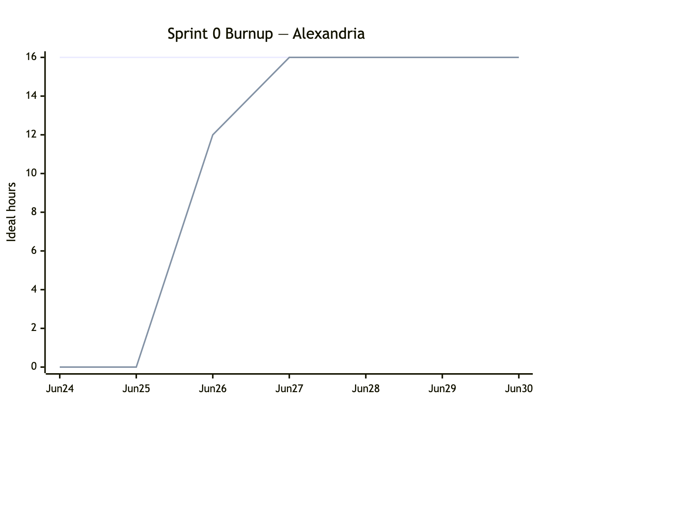
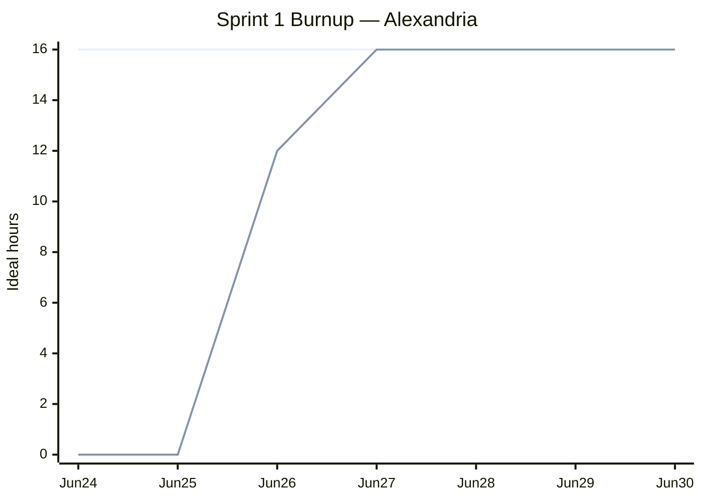

# Sprint 1 Report

**Product:** Alexandria (Prompt Optimization for LLM Applications / Coding Agent) ·
**Team:** Alexandria ·
**Date:** Jul 1, 2026

## Actions to stop doing

None this sprint. The current process worked well, so we have nothing we want to stop doing.

## Actions to start doing

- Break the sprint's user story into concrete tasks up front, assign an owner to each task, and
  file the still-unassigned tasks first — so that everyone can see exactly what needs to be done
  and who is doing it.

## Actions to keep doing

- Keep shipping fast: write code quickly and merge to `main`. Linter, formatter, type checker,
  tests, and CI are already in place as a safety guard against bad implementations, so any change
  that passes CI may be merged to `main`.

## Work completed / not completed

### Completed

- **Sprint 1 user story (release plan):** As an engineer who uses Cursor or Claude Code, I want a
  one CLI command that cuts the token count of my agent-instruction file by removing redundant
  instructions while keeping meaning intact. Shipped end to end (represent → score → optimize →
  select) behind the `reduce` command.

### Not completed (planned but unfinished)

- None.

## Work completion rate

- User stories completed: 1
- Ideal work hours completed: 16
- Days in sprint: 7 (Jun 24–30, 2026)
- User stories / day: 0.14
- Ideal work hours / day: 2.3

### Sprint 1 burnup chart

Upper line: total scope (16h). Lower line: cumulative ideal hours completed, reconstructed from the
GitHub commit history. Jun 24–25 covered project scaffolding, CI, and planning docs, which are not
part of the user story's ideal hours, so the completed line stays at 0. Feature work began on Jun 26,
when the represent → score → optimize phases plus the pipeline and CLI landed, and the final select
phase merged on Jun 27 (PR #4), completing the story end to end. It held through the end of the
sprint.
