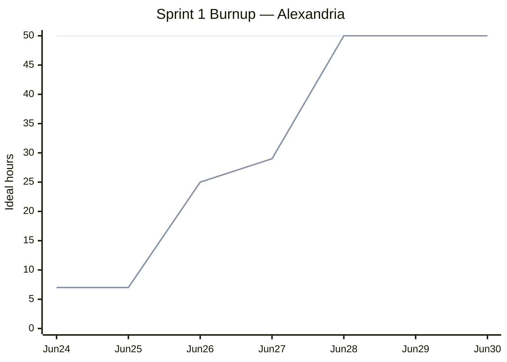

# Sprint 1 Plan

**Product:** Alexandria (Prompt Optimization for LLM Applications / Coding Agent) ·
**Team:** Alexandria ·
**Sprint completion date:** Tue, Jun 30, 2026 ·
**Revision:** 2.0 (2026-07-06)

## Goal

Ship the optimization pipeline end to end behind one CLI command: turn a prompt into the
`Document` IR (Represent), compute per-instruction `redundancy` scores (Score), and drop
redundant instructions with `greedy_pairwise` (Optimize). In parallel, run the research spike
that prepares the Sprint 2 benchmark, on top of a fresh repo scaffold with CI.

## Task listing (by user story, priority order)

Estimates are ideal hours (each task ≤ 6h).

### User story: Shorten a prompt end to end (G1, G3 · Customer/User value · Priority 1)

> As an engineer using Cursor or Claude Code whose `CLAUDE.md` / `AGENT.md` has grown bloated,
> I want a one CLI command that cuts the token count of that agent-instruction file by removing
> redundant instructions while keeping meaning intact, so that I cut the per-token cost I pay on
> every request and avoid the accuracy loss that comes with a bloated prompt.

> _Built incrementally: first a PoC that runs end to end, then each step is improved
> (better segmentation, scoring, and optimization) in later increments._

- Represent: split the prompt into instructions and embed each one (6h)
- Score: rate how redundant each instruction is (4h)
- Optimize: drop redundant instructions while preserving meaning (6h)
- CLI: run the whole pipeline, prompt in and reduced prompt out (4h)

**Total for the user story: 20 hours**

## Enabling work (not user stories)

These items deliver no value to the user on their own, but the user story cannot land without
them, and the spike prepares Sprint 2. Each is an imperative backlog item tagged with the kind
of value it delivers, listed in priority order. The infrastructure enabler lands first.

### Enabler A: Research spike toward the Sprint 2 benchmark (Spike / Technical value · Priority 2)

Survey prompt-optimization work, how token count affects LLM accuracy, and existing prompt/agent
benchmarks. Each task produces a note following
[docs/research/TEMPLATE.md](research/TEMPLATE.md).

- [spike] Prompt optimization: 2-3 works on prompt compression/optimization (5h)
- [spike] Long-prompt effects: 2-3 papers on long-context degradation (5h)
- [spike] Prompt-writing techniques (2026 papers only): extract reproducible techniques (5h)
- [spike] Accuracy benchmarks: find one publishing exact eval prompts + ground truth (6h)

**Total for Enabler A: 21 hours**

### Enabler B: Repo scaffold and CI (Infrastructure / Technical value · Priority 3)

A project scaffold and a CI pipeline, so that multiple developers can work on the codebase while
holding a minimum code-quality bar. Lands before the user story's tasks.

- Set up repo scaffold and packaging (3h)
- Set up CI to run lint, type check, and tests on every push (4h)
- Write install / run instructions (2h)

**Total for Enabler B: 9 hours**

## Team roles

- Masa Ishihara: Product Owner
- Matthew Zerner: _(TBD)_
- Virinchi Chintala: _(TBD)_
- Marc Dylan Tan: _(TBD)_

## Initial task assignment

- Masa Ishihara: The user story (shorten a prompt end to end), build the end-to-end PoC
- Matthew Zerner: _(TBD)_
- Virinchi Chintala: _(TBD)_
- Marc Dylan Tan: _(TBD)_
- Jack Dao: _(TBD)_

## Initial burnup chart

Scope is the full task listing above: 50 ideal hours (user story 20h + Enabler A 21h +
Enabler B 9h). The completed line is reconstructed from the GitHub commit history; the
[Sprint 1 report](sprint-1-report.md)'s chart tracks actual hours spent instead.

Upper line: total scope (50h). Lower line: cumulative ideal hours completed. Jun 24: repo
scaffold, packaging, and CI landed (PR #1, 7h). Jun 26: install/run instructions plus the
represent, score, and optimize phases (25h). Jun 27: the CLI merged with the select phase
(PR #4), completing the user story (29h). Jun 28: all research-spike notes landed (PR #6),
finishing the sprint scope (50h), and it held through the end of the sprint.

## Initial scrum board

<https://github.com/orgs/ucsc-cse115a-alexandria/projects/1/views/1>

## Scrum times

_(TBD: at least three weekly Scrum meeting days/times; indicate which meeting the TA/tutor attends,
expected during the lab-time Scrum.)_
