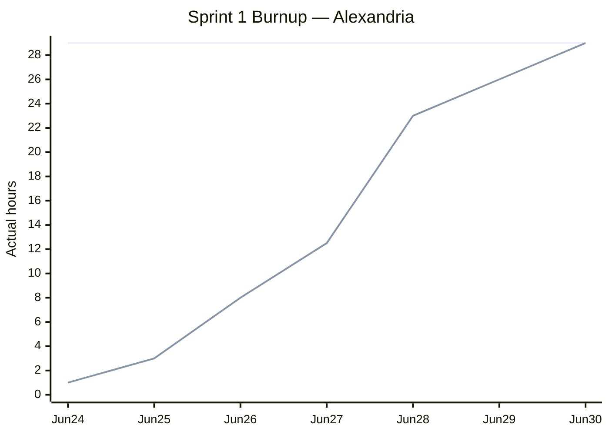

# Sprint 1 Report

**Product:** Alexandria (Prompt Optimization for LLM Applications / Coding Agent) ·
**Team:** Alexandria ·
**Date:** Jul 1, 2026

## Actions to stop doing

None this sprint. The current process worked well, so we have nothing we want to stop doing.

## Actions to start doing

- Break the sprint's user story into concrete tasks up front, assign an owner to each task, and
  file the still-unassigned tasks first — so that everyone can see exactly what needs to be done
  and who is doing it.

## Actions to keep doing

- Keep shipping fast: write code quickly and merge to `main`. Linter, formatter, type checker,
  tests, and CI are already in place as a safety guard against bad implementations, so any change
  that passes CI may be merged to `main`.

## Work completed / not completed

### Completed

- **Sprint 1 user story (release plan):** As an engineer who uses Cursor or Claude Code, I want a
  one CLI command that cuts the token count of my agent-instruction file by removing redundant
  instructions while keeping meaning intact. Shipped end to end (represent → score → optimize →
  select) behind the `reduce` command.

### Not completed (planned but unfinished)

- None.

## Work completion rate

- User stories completed: 1
- Actual work hours: 29
- Days in sprint: 7 (Jun 24–30, 2026)
- User stories / day: 0.14
- Actual work hours / day: 4.1

Hours are actual time spent on sprint work, broken down by merged PR:

| PR | Work | Hours |
|----|------|------:|
| #1 | Core package + coverage setup | 2 |
| #2 | Sprint 1 plan docs | 1 |
| #3 | Spec update (0626) | 1.5 |
| #4 | Prototype: represent → score → optimize → select, pipeline, CLI | 8 |
| #6 | Research notes for all six papers | 10 |
| #7 | Skill-analyze / fidelity-probe scripts | 2.5 |
| #8 | Alexandria logo | 1.5 |
| #9 | Spec v2 draft | 1 |
| #10 | Sprint 2–4 user-story revision | 1.5 |
| **Total** | | **29** |

### Sprint 1 burnup chart

Upper line: total actual hours spent over the sprint (29h). Lower line: cumulative actual hours.
Jun 24–25 covered project scaffolding, CI, and planning docs (3h). Jun 26–27 was the bulk of the
feature work: the represent → score → optimize phases, the pipeline, and the CLI landed on Jun 26,
and the select phase merged on Jun 27 (PR #4), completing the user story end to end. Jun 28 added
the fidelity-probe scripts plus Marc's research notes for all six papers (PR #6). Jun 29–30 closed
out the sprint with the v2 spec draft, product-structure docs, the logo (PR #8), and the revised
Sprint 2–4 user stories (PR #10).
