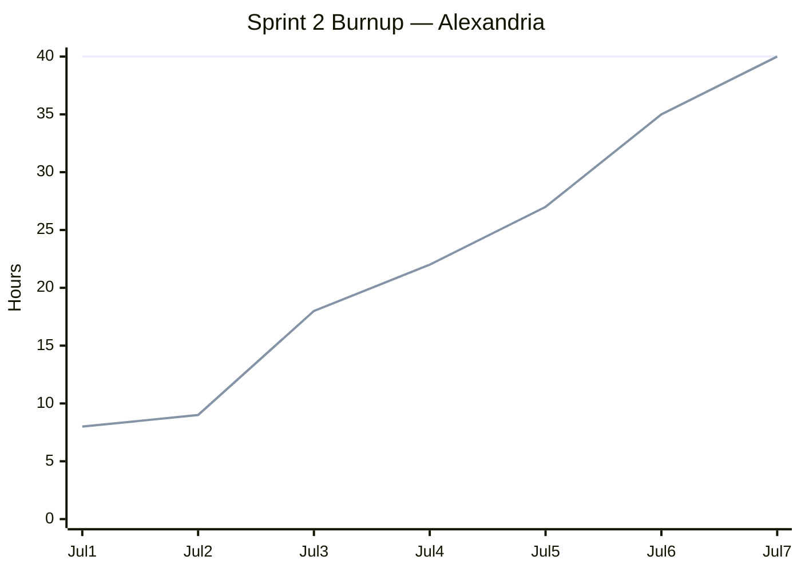

# Sprint 2 Report

**Product:** Alexandria (Prompt Optimization for LLM Applications / Coding Agent) ·
**Team:** Alexandria ·
**Date:** Jul 9, 2026

## Actions to stop doing

- Stop defining tasks with strong dependencies on each other. When one task depends on another, a
  delay in the first task blocks the second.

## Actions to start doing

- Include test cases in the task definition. When we write a task, we also write the test cases
  it must pass. This makes the goal of the task clear before we start.
- Define more functional tasks, not evaluation tasks. In Sprint 2 much of the work was the
  benchmark survey and candidate rating (Enabler A). That work rated options but did not build a
  feature the user can run.

## Actions to keep doing

- Keep the three weekly scrum meetings. They kept everyone aware of who works on what.
- Do not merge a PR until CI passes. We want to keep building CI and tracking test coverage,
  applying the engineering practices covered in ROC2 ("Scrum + Engineering Practices:
  Experiences of Three Microsoft Teams").
- Split user story tasks into small tasks. We can break a task into as many small tasks as we
  need.

## Work completed / not completed

### Completed

- **User story 2 (partial): `--min-similarity` option (#30).** `reduce` and the new `compare`
  command stop before reduction crosses the similarity floor the user sets.
- **Enabler A (spike): benchmark survey (#25) and candidate rating with shortlist (#27).**
  Research notes for the candidate benchmarks, plus a rating of each candidate against the
  acceptance criteria.
- **Enabler B: leak-proof fidelity dataset, 4 of 5 tasks.** Skill-corpus download script (#12),
  the skill-corpus repository (#18), the redundancy inflation script with the 99% similarity
  gate (#19), and the compression fidelity check (#20).
- **Enabler C (all): split the library from the CLI.** The public API now takes plain options
  and builds its own defaults (#22), the CLI moved into its own `alexandria/cli/` package (#23),
  and an import contract test locks the seam (#24).

### Not completed (planned but unfinished)

- **User story 1 (accuracy proof):** the before/after accuracy experiment (#29) and the README
  write-up did not start.
- **User story 2: `--max-tokens` option (#31) and token counting in the CLI (#32).**
- **Enabler A: trial the top candidate and pick the base benchmark (#28).**
- **Enabler B: dataset generator (#21).**

## Work completion rate

- User stories completed: 0 (User story 2 shipped 1 of its 3 tasks)
- Actual work hours: 40
- Days in sprint: 7 (Jul 1–7, 2026)
- User stories / day: 0
- Actual work hours / day: 5.7
- Average across all sprints to date (Sprints 1–2, 14 days): 0.14 user stories / day,
  5.4 actual work hours / day

Hours are actual time spent on sprint work, broken down by merged PR:

| PR | Work | Hours |
|----|------|------:|
| — | Sprint 1 report + Sprint 2 plan docs (direct to `main`) | 2 |
| #11 | Skill-corpus download script + corpus repository (#12, #18) | 5 |
| #33, #35 | Enabler C: restructure, public API, CLI package (#22–#24) | 7 |
| #36, #37 | Compression fidelity check + `compare` command (#20) | 5 |
| #38 | `--min-similarity` option (#30) | 4 |
| #39, #41 | Enabler A: benchmark survey + rating and shortlist (#25, #27) | 8 |
| #40 | Redundancy inflation script (#19) | 4 |
| — | Enabler A: IFEval trial (#28, in progress at sprint end) | 5 |
| **Total** | | **40** |

### Sprint 2 burnup chart

