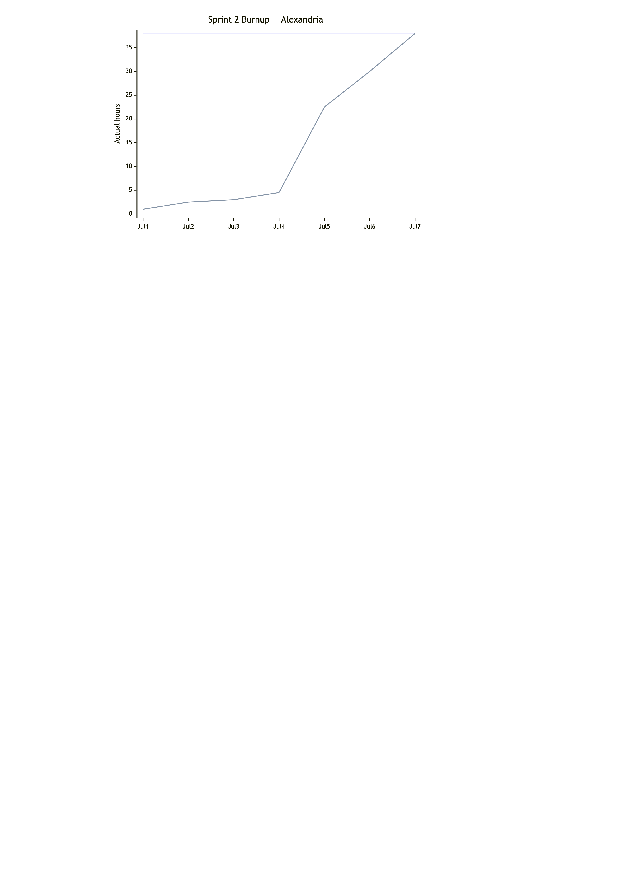
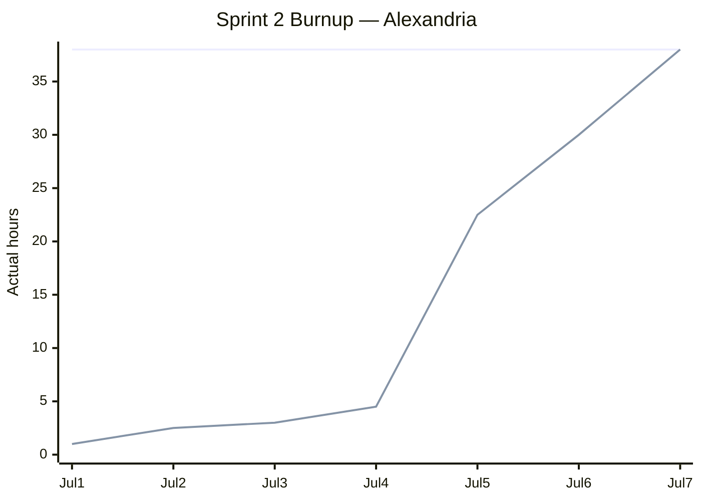

# Sprint 2 Report

**Product:** Alexandria (Prompt Optimization for LLM Applications / Coding Agent) ·
**Team:** Alexandria ·
**Date:** Jul 9, 2026

## Actions to stop doing

- Stop putting all enabler work before the user story. The benchmark spike (Enabler A) ran until
  the last day of the sprint, so User story 1 never started.

## Actions to start doing

- Assign an owner to every task at the start of the sprint. Task #29 (run the accuracy
  experiment) had no owner, and nobody picked it up.
- Start the tasks that other tasks depend on earlier. User story 1 waited for the benchmark
  pick, and the pick landed only after the sprint ended.

## Actions to keep doing

- Keep shipping fast: write code quickly and merge to `main`. Linter, formatter, type checker,
  tests, and CI stay in place as a safety guard, so any change that passes CI may be merged.
- Keep the three weekly scrum meetings. They kept everyone aware of who works on what.

## Work completed / not completed

### Completed

- **User story 2 (partial): `--min-similarity` option (#30).** `reduce` and the new `compare`
  command stop before reduction crosses the similarity floor the user sets.
- **Enabler A (spike): benchmark survey (#25) and candidate rating with shortlist (#27).**
  Research notes for the candidate benchmarks, plus a rating of each candidate against the
  acceptance criteria.
- **Enabler B: leak-proof fidelity dataset, 4 of 5 tasks.** Skill-corpus download script (#12),
  the skill-corpus repository (#18), the redundancy inflation script with the 99% similarity
  gate (#19), and the compression fidelity check (#20).
- **Enabler C (all): split the library from the CLI.** The public API now takes plain options
  and builds its own defaults (#22), the CLI moved into its own `alexandria/cli/` package (#23),
  and an import contract test locks the seam (#24).

### Not completed (planned but unfinished)

- **User story 1 (accuracy proof):** the before/after accuracy experiment (#29) and the README
  write-up did not start. Both waited on the benchmark pick from Enabler A.
- **User story 2: `--max-tokens` option (#31) and token counting in the CLI (#32).**
- **Enabler A: trial the top candidate and pick the base benchmark (#28).** The IFEval trial and
  the rationale landed on Jul 8, one day after the sprint ended.
- **Enabler B: dataset generator (#21).** Merged on Jul 9.

## Work completion rate

- User stories completed: 0 (User story 2 shipped 1 of its 3 tasks)
- Actual work hours: 38
- Days in sprint: 7 (Jul 1–7, 2026)
- User stories / day: 0
- Actual work hours / day: 5.4
- Average across all sprints to date (Sprints 1–2, 14 days): 0.07 user stories / day,
  4.8 actual work hours / day

Hours are actual time spent on sprint work, broken down by merged PR:

| PR | Work | Hours |
|----|------|------:|
| — | Sprint 1 report + Sprint 2 plan docs (direct to `main`) | 3 |
| #11 | Skill-corpus download script + corpus repository (#12, #18) | 5 |
| #33, #35 | Enabler C: restructure, public API, CLI package (#22–#24) | 6 |
| #36, #37 | Compression fidelity check + `compare` command (#20) | 4 |
| #38 | `--min-similarity` option (#30) | 4 |
| #39, #41 | Enabler A: benchmark survey + rating and shortlist (#25, #27) | 8 |
| #40 | Redundancy inflation script (#19) | 3 |
| — | Enabler A: IFEval trial (#28, in progress at sprint end) | 5 |
| **Total** | | **38** |

### Sprint 2 burnup chart

Upper line: total actual hours spent over the sprint (38h). Lower line: cumulative actual hours.
Jul 1–4 was slow: most of the work was the Sprint 1 report and the Sprint 2 plan, and Jul 3 was
a holiday. Work peaked in the second half. On Jul 5 the Enabler C restructure and the
skill-corpus download script landed. On Jul 6 the compression fidelity check, the `compare`
command, the `--min-similarity` work, and the benchmark survey notes landed. On Jul 7 the
redundancy inflation script and the candidate shortlist landed, and the sprint ended.
