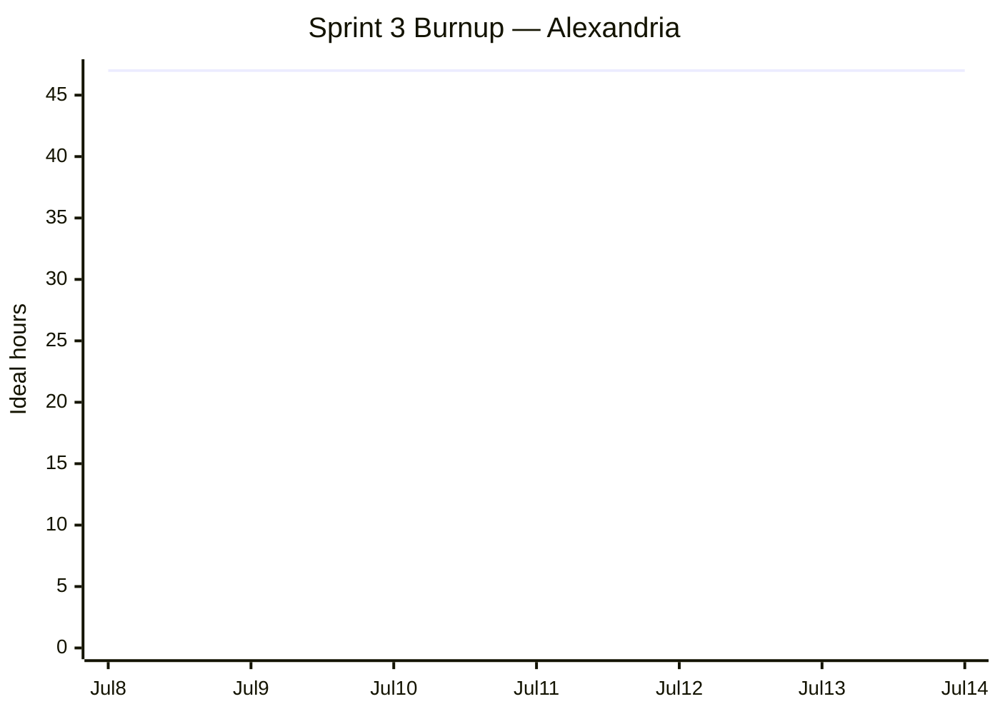

# Sprint 3 Plan

**Product:** Alexandria ·
**Team:** Alexandria ·
**Sprint completion date:** Tue, Jul 14, 2026 ·
**Revision:** 1.0 (2026-07-09)

## Goal

Make optimization easier to control and inspect. The user can review each suggested edit before
it is applied (in the CLI or a GUI), watch token usage and quality over time, and inspect each
phase's intermediate output. The sprint also improves compression against the benchmark, so the
user saves more tokens while accuracy holds.

## Task listing (by user story, priority order)

### User story 1: Review optimization suggestions from the CLI (G3 · Customer/User value · Priority 1)

> As an AI application engineer who works mainly in the CLI, I want to review each optimization
> suggestion and accept or reject it before it is applied, so that I keep control over how my
> prompt changes instead of trusting a fully automatic run.

Acceptance criteria:

- The CLI shows each proposed edit.
- The user can accept or reject each edit.
- Only accepted edits appear in the final output.

Tasks:

- Expose the optimizer's proposed edits as a list of discrete diffs the CLI can show one by one (4h)
- Add an interactive accept/reject prompt per edit to `reduce` (e.g. `--interactive`) (4h)
- Apply only the accepted edits to the final output, with tests (3h)

**Total for user story 1: 11 hours**

### User story 2: Review optimization suggestions with a GUI (G3 · Customer/User value · Priority 2)

> As an AI application engineer who prefers a visual interface over the CLI, I want to review the
> optimization suggestions on a GUI (an HTML page), so that I can compare edits more easily and
> choose which ones to apply.

Depends on the per-edit review from user story 1; do US1 first.

Acceptance criteria:

- The CLI can open the GUI (an HTML page).
- The user sees each edit as a diff and selects which ones to apply.
- The selection goes back to the CLI run.

Tasks:

- Generate a local HTML page that shows each proposed edit as a diff with accept/reject controls (5h)
- Open the page from the CLI and read the user's selection back into the run (4h)

**Total for user story 2: 9 hours**

### User story 3: Monitor prompt token usage (G3 · Customer/User value · Priority 3)

> As an engineer who maintains agent instructions (`CLAUDE.md`, `AGENT.md`, skills) for a
> development team, I want to see the token usage of all instruction files in one place, so that I
> can spot prompt bloat before it slows the developers down. Large instruction files raise the
> input tokens of every session, so they cost money and shrink the effective context window.

Acceptance criteria:

- One command lists the token counts of `CLAUDE.md`, `AGENT.md`, skills, and similar files.
- It runs from the CLI.
- It is quick enough to run as a regular check.

Tasks:

- Add a CLI command that scans the instruction files in a directory and lists token counts per
  file plus a total (4h)

**Total for user story 3: 4 hours**

### User story 4: Monitor optimization quality over time (G2 · Customer/User value · Priority 4)

> As an engineer who maintains AI prompt infrastructure, I want to measure quality metrics, not
> only token counts, so that I can watch prompt quality over time and catch regressions through
> CI. Token count alone does not show whether a prompt got better or worse.

Acceptance criteria:

- The output includes both token counts and quality scores.
- It runs from the CLI.
- It runs in CI for continuous monitoring.

Tasks:

- Extend the report command to output token counts plus quality scores in a machine-readable
  format (3h)
- Add a CI recipe that runs the report on every push and flags a regression (3h)

**Total for user story 4: 6 hours**

### User story 5: Run the optimization pipeline step by step (G3 · Customer/User value · Priority 5)

> As a CLI user, I want to run each optimization phase on its own and inspect the intermediate
> outputs, so that I can understand what the optimizer does and debug or customize the workflow
> instead of always running the whole pipeline.

Each phase can already run on its own. What is missing is the saved intermediate data, so this
story adds JSON output between phases.

Acceptance criteria:

- Each phase saves its intermediate output as a JSON file.
- A phase can start from a saved JSON file, so the user can rerun only the phases they need.
- The full-pipeline command still works.

Tasks:

- Save each phase's intermediate output as a JSON file (3h)
- Let a phase start from a saved JSON file, so one phase can be rerun alone (3h)

**Total for user story 5: 6 hours**

### User story 6: Save more tokens while the benchmark confirms accuracy (G1, G2 · Customer/User value · Priority 6)

> As an engineer building an LLM application where every extra token saved is real money, I want
> Alexandria to compress harder while the benchmark confirms my agent stays as accurate, so that
> I save more tokens without giving up accuracy.

Carries over the unfinished Sprint 2 US1 work: the baseline experiment is issue #29 and the
docs write-up is issue #26. Depends on Enabler A (#28) landing first — see the enabling work
below.

Acceptance criteria:

- The benchmark runs on the prompt before and after a compression change.
- A compression change is kept only when the benchmark shows accuracy holds.
- The final accuracy and token-reduction numbers are recorded in the docs.

Tasks:

- Run the benchmark on the current default strategy and record baseline accuracy and token
  reduction (3h)
- Tune the compression (scorer, optimizer, selector) and measure each change against the
  baseline (5h)
- Keep only the changes where accuracy holds and record the final numbers in the docs (2h)

**Total for user story 6: 10 hours**

### Enabling work (carryover from Sprint 2)

#### Enabler A — Pick the base benchmark (Technical value · before US6)

Sprint 2's Enabler A spike is one step from done: trial the top candidate and pick the base
benchmark (#28, in review). US6 runs this benchmark, so it lands before US6 starts.

Tasks:

- Finish the trial, review, and merge the benchmark pick (1h)

**Total for enabling work: 1 hour**

## Capacity sanity check

- Team of 4, one-week sprint: roughly **32 to 48 ideal hours** at 8 to 12 per person.
- The six stories plus the carryover enabler total **47 hours**, near the top of the band and
  above the ~85% planning target.
- Commit order: US1 → Enabler A → US6 → US3 → US4 → US5 → US2. Enabler A and US6 carry over
  Sprint 2's accuracy work and have slow feedback loops (benchmark runs), so they start early;
  the trim candidates stay last.
- If over capacity, return US2 (9h) to the product backlog first, then US5 (6h). US1 already gives
  edit review in the CLI, so the GUI is the safest cut.

## Release plan note

The [release plan](release-plan.md) scoped Sprint 3 to harder compression (G1) plus convenience
commands. This plan keeps the compression story (US6) and replaces the convenience commands with
interactive review, monitoring, and saved phase outputs, which the team chose as the higher-value
work. The packaging spike moves to Sprint 4. The release plan should be revised to match.

## Team roles

- Masa Ishihara: Product Owner
- Matthew Zerner: Scrum Master
- Virinchi Chintala: Team
- Marc Dylan Tan: Team

## Initial task assignment

- Masa Ishihara: 
- Matthew Zerner: 
- Virinchi Chintala:
- Marc Dylan Tan: 

## Initial burnup chart

Scope line is the committed 47 ideal hours; the completed line starts at zero.

## Initial scrum board

<https://github.com/orgs/ucsc-cse115a-alexandria/projects/1/views/1>

## Scrum times

Three weekly scrum meetings (daily-scrum equivalent):

- **Monday 5:30pm**, right after the TA meeting with Scott (5:00 to 5:30pm). TA and tutor present.
- **Thursday 5:15pm**, right after the TA meeting with Scott (4:45 to 5:15pm). TA and tutor present.
- **Saturday 5:00pm**, team only.
