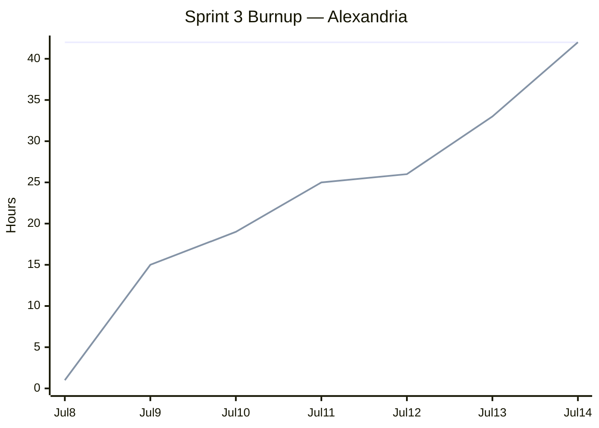

# Sprint 3 Report

**Product:** Alexandria (Prompt Optimization for LLM Applications / Coding Agent) ·
**Team:** Alexandria ·
**Date:** Jul 16, 2026

## Actions to stop doing

- Stop carrying too much Sprint 2 spillover into the next sprint without explicitly reserving
  capacity for it. Sprint 3 still finished valuable work, but carryover items competed with the
  highest-priority Sprint 3 stories.

## Actions to start doing

- Separate planned sprint capacity from carryover and unplanned support work in the sprint report.
  This makes the completion rate easier to understand when the git log includes useful work that
  was not in the original sprint scope.
- Add CI work as a concrete acceptance item with the exact workflow file and command. The report
  command landed, but the planned CI recipe did not.

## Actions to keep doing

- Keep landing small, reviewable PRs. Sprint 3 moved several user-facing features through short
  issue-sized PRs: discrete diffs, interactive review, saved phase JSON, token reporting, and
  browser review.
- Keep writing tests with the feature PRs. The git log shows tests landing with the CLI review,
  phase JSON, token, report, and browser review work.

## Work completed / not completed

### Completed

- **User story 1: review optimization suggestions from the CLI.** Discrete diffs (#51), the
  `reduce --interactive` accept/reject flow (#52), and applying only accepted edits (#53) shipped
  with tests.
- **User story 2: review optimization suggestions with a GUI.** The self-contained HTML review page
  generator (#54) landed, and `reduce --browser` with browser selection round-trip (#55) was
  implemented on Jul 14 and merged on Jul 15.
- **User story 3: monitor prompt token usage.** The `tokens` CLI command (#56) lists instruction-file
  token counts and totals.
- **User story 5: run the optimization pipeline step by step.** Phase commands can save
  intermediate JSON with `--out` (#59), and tests/docs pin that a phase can start from a saved JSON
  file (#60).
- **Enabler A carryover: pick the base benchmark.** The IFEval trial and benchmark rationale (#28)
  landed in PR #42.
- **Sprint 2 carryover.** The dataset generator (#21), `--max-tokens` option (#31), and reduce token
  counting / reduction percentage (#32) landed during the Sprint 3 calendar window or immediately
  after the final sprint-day implementation work.
- **Supporting work.** Sprint 3 planning/report cleanup (#44, direct report updates), CLI/library
  documentation split (#70), and Discord progress notifications (#65) landed.

### Not completed (planned but unfinished)

- **User story 4: monitor optimization quality over time (partial).** The `report` command now emits
  token metrics, quality scores, and baseline regression comparisons (#71), but the planned CI recipe
  that runs the report on every push did not land.
- **User story 6: save more tokens while the benchmark confirms accuracy.** The base benchmark
  enabler landed, but the baseline run, compression tuning, and final documented accuracy/token
  numbers did not land.

## Work completion rate

- User stories completed: 4 of 6 (US1, US2, US3, and US5)
- Planned Sprint 3 task hours completed: 34 of 47
- Planned task completion rate: 72%
- Actual work hours: 42
- Days in sprint: 7 (Jul 8-14, 2026)
- User stories / day: 0.57
- Completed planned task hours / day: 4.9
- Actual work hours / day: 6.0
- Average across all sprints to date (Sprints 1-3, 21 days): 0.29 user stories / day,
  5.6 actual work hours / day

Planned task completion counts the Sprint 3 plan's 47 ideal hours: US1 (11h), US2 (9h), US3 (4h),
US4 partial (3h of 6h), US5 (6h), US6 (0h of 10h), and Enabler A (1h). It excludes carryover and
support work from the 72% completion rate, but those hours are still included in actual work hours
below.

Hours are estimated actual time spent on sprint work, using git-log dates and the planned task sizes
where they match the work:

| PR | Work | Hours |
|----|------|------:|
| #44, — | Sprint 2 report revisions + Sprint 3 plan/docs | 2 |
| #43 | Sprint 2 carryover: dataset generator (#21) | 4 |
| #62, #63, #64 | User story 1: discrete diffs, interactive review, accepted-only output (#51-#53) | 11 |
| #65 | Discord progress notifications | 2 |
| #42 | Enabler A: IFEval trial and benchmark rationale (#28) | 2 |
| #66 | User story 5: save/resume phase JSON (#59-#60) | 6 |
| #68 | User story 3: instruction-file token counts (#56) | 4 |
| #69, #74 | User story 2: HTML review page + browser selection round-trip (#54-#55) | 7 |
| #70 | CLI/library documentation split | 1 |
| #71 | User story 4 partial: report metrics and baseline comparison | 2 |
| #72, #73 | Sprint 2 carryover: `--max-tokens` and reduce token stats (#31-#32) | 1 |
| **Total** | | **42** |

### Sprint 3 burnup chart

The completed line tracks estimated actual work hours credited by git-log date. Jul 12 had no commit
in the log, so it receives a small progress credit rather than a flat day.

