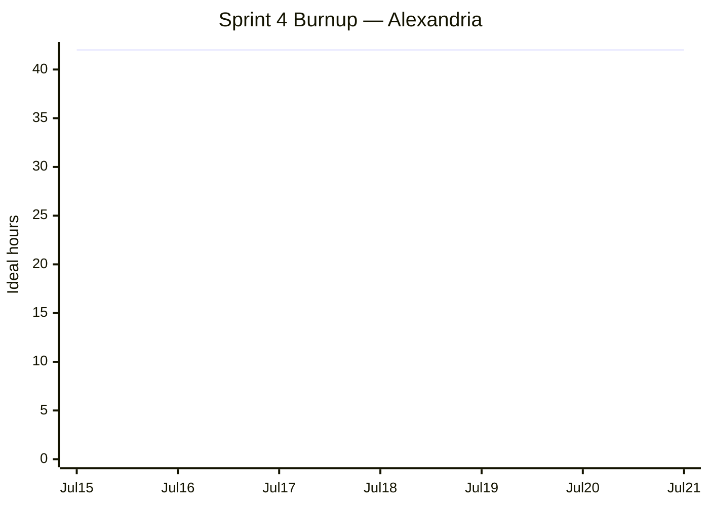

# Sprint 4 Plan

**Product:** Alexandria ·
**Team:** Alexandria ·
**Sprint completion date:** Tue, Jul 21, 2026 ·
**Revision:** 2.0 (2026-07-16)

## Goal

Release Alexandria 1.0 with benchmark numbers that a user can trust and enough open-source
documentation for someone outside the class project to install, run, and contribute to it. Most of
this sprint is measurement: freeze the evaluation protocol, run the default strategy, run a small
compression-strength sweep, and publish accuracy, token reduction, wall-clock time, and cost. Keep new
implementation small: only CI regression monitoring, release smoke tests, and narrow benchmark-backed
compression changes should land.

## Task listing (by user story, priority order)

### User story 1: Publish the default benchmark result (G2 · Customer/User value · Priority 1)

> As an engineer deciding whether to use Alexandria, I want benchmark numbers for the default
> compression strategy, so that I can judge whether the shortened prompt keeps accuracy while saving
> tokens.

Acceptance criteria:

- The evaluation protocol states the benchmark, subset, model, compression command, metrics,
  pass/fail threshold, and cost/time collection method.
- Raw benchmark outputs and summarized results are saved in the repo or clearly linked from the docs.
- The docs publish original-vs-compressed accuracy, token reduction, wall-clock time, and estimated
  API cost.

Tasks:

- Freeze the Sprint 4 evaluation protocol and command log, using the BABILong benchmark selected by the
  Sprint 2/3 benchmark work rather than reopening the benchmark survey (2h)
- Run the original prompts and Alexandria's default compressed prompts through the benchmark, recording
  prompt-level and instruction-level accuracy, token reduction, wall-clock time, and API cost (5h)
- Bootstrap confidence intervals for the reported accuracy-retention measurements (3h)
- Publish the result in the README or docs with exact commands, assumptions, and caveats (3h)

**Total for user story 1: 13 hours**

### User story 2: Save more tokens while the benchmark confirms accuracy (G1, G2 · Customer/User value · Priority 2)

> As an engineer building an LLM application where every extra token saved is real money, I want
> Alexandria to compress harder while the benchmark confirms my agent stays as accurate, so that I
> save more tokens without giving up accuracy.

Carries over the unfinished Sprint 3 user story 6. Keep this bounded: the sprint should produce a
measured release default, not a broad optimizer rewrite.

Acceptance criteria:

- The sweep includes the original prompt, the current default strategy, and at least three
  stronger/weaker compression settings.
- Each point reports accuracy retention, token reduction, wall-clock time, and estimated cost.
- The final default operating point is recorded in the release docs.

Tasks:

- Define the sweep matrix for the available controls (`--min-similarity`, `cos_sim_diff` budget, thresholds, or
  token targets) and write the exact commands in a runbook (2h)
- Run the sweep on the selected benchmark subset and save raw outputs for every point (4h)
- Make at most one narrow default/parameter change if the sweep shows a better benchmark-backed
  operating point; do not refactor the optimizer in this sprint (2h)
- Summarize the curve and record the final default accuracy/token numbers in the docs (2h)

**Total for user story 2: 10 hours**

### User story 3: Monitor optimization quality in CI (G2 · Customer/User value · Priority 3)

> As an engineer who maintains AI prompt infrastructure, I want the quality report to run in CI, so
> that regressions in token savings or quality scores are caught before they reach users.

Carries over the unfinished part of Sprint 3 user story 4. The `report` command already emits token
metrics, quality scores, and baseline comparisons; what remains is wiring it into CI.

Acceptance criteria:

- A CI workflow runs the report command on every push or pull request.
- The workflow fails when reduced token count rises or monitored quality scores fall beyond the
  configured tolerances.
- The workflow command and baseline file are documented so contributors can reproduce the check
  locally.

Tasks:

- Add the CI recipe for the committed report baseline and exact `alexandria report` command (2h)
- Document how to update the baseline when an intentional compression-quality change lands (1h)

**Total for user story 3: 3 hours**

### User story 4: Verify the release install path (G3 · Customer/User value · Priority 4)

> As an engineer who wants to try Alexandria outside the project checkout, I want a clean install path
> and runnable CLI/library examples, so that I can reproduce the published benchmark result and start
> using the tool in my own workflow.

Acceptance criteria:

- A clean environment can install Alexandria from the built package or published package.
- The installed CLI and Python library examples run.
- The install/quickstart docs link to the benchmark result.

Tasks:

- Build the wheel/sdist and install it in a clean environment; fix only packaging blockers found by
  that smoke test (2h)
- Run installed-package smoke tests for the CLI and Python API (2h)
- Update install and quickstart notes so a user can reproduce the benchmark command and use the default
  strategy (1h)

**Total for user story 4: 5 hours**

### User story 5: Prepare the project for open-source contributors (G3 · Customer/User value · Priority 5)

> As a developer finding Alexandria as an open-source project, I want clear README, contribution, CLI,
> and library documentation, so that I can understand what the project does, run it locally, use it in
> scripts, and make a contribution without asking the maintainers for basic setup steps.

Acceptance criteria:

- `README.md` clearly explains the project value, install steps, quickstart, benchmark evidence, and
  links to deeper docs.
- A contribution guide exists and covers local setup, test/lint/type-check commands, PR expectations,
  and how to update generated benchmark/report artifacts.
- Separate CLI and library docs explain common workflows with runnable examples.
- The docs distinguish release-ready behavior from known limitations and future backlog.

Tasks:

- Rewrite the README structure for OSS readers: overview, install, quickstart, benchmark result,
  CLI/library links, development commands, and known limitations (2h)
- Create `CONTRIBUTING.md` (or `CONTRIBUTE.md` if the team chooses that filename) with setup,
  workflow, tests, style expectations, and PR checklist (2h)
- Refresh `docs/cli.md` with examples for `reduce`, `--interactive`, `--browser`, `tokens`, `report`,
  and phase-by-phase JSON workflows (2h)
- Refresh `docs/library.md` with importable API examples, deterministic/offline embedder usage, and
  guidance for composing phases from Python (1h)

**Total for user story 5: 7 hours**

## Enabling work (not user stories)

These items do not deliver standalone user value, but the benchmark evidence is hard to trust without
them. Keep them small; the sprint should not turn into another implementation sprint.

### Enabler A: Reproducible benchmark artifacts (Technical value · Priority 6)

- Define a results directory convention and raw-output format for Sprint 4 benchmark runs, preferring
  JSON/CSV already emitted by the CLI where possible (1h)
- Add a canonical runbook, make target, or thin script for the benchmark commands only if manual
  repetition would make the results error-prone (2h)
- Add one cheap deterministic smoke test for benchmark plumbing; do not put the full LLM benchmark in
  CI (1h)

**Total for Enabler A: 4 hours**

## Capacity sanity check

- Team of 4, one-week sprint: roughly **32 to 48 ideal hours** at 8 to 12 per person.
- The five stories plus the enabler total **42 hours**, inside the band and intentionally weighted
  toward benchmark measurement and release documentation rather than new product features.
- Measurement-focused work is US1 + US2 + Enabler A = **27 hours**. Implementation work is limited to
  the CI recipe, release smoke-test fixes, and at most one narrow default/parameter change.
- Commit order: US1 protocol → Enabler A as needed → US1 default benchmark run → US2 sweep/default
  decision → US3 CI regression check → US4 install path → US5 OSS docs.
- If over capacity, cut the optional default/parameter change in US2 first (2h), then reduce US5 to
  README + CONTRIBUTING only (3h cut), then reduce US4 to a wheel install smoke test without PyPI
  publication. Do not cut the default benchmark result.

## Release plan note

The [release plan](release-plan.md) scopes Sprint 4 to package release and broader accuracy
evaluation. This plan keeps that direction but incorporates the Sprint 3 unfinished work explicitly:
quality monitoring must run in CI, and the compression-strength work must be measured against the
benchmark before any stronger default is kept. Packaging work is limited to the smallest install path
needed for Release 1.0; PyPI publication is behind the benchmark result and depends on credentials and
remaining capacity.

## Team roles

- Masa Ishihara: Product Owner
- Matthew Zerner: Scrum Master
- Virinchi Chintala: Team
- Marc Dylan Tan: Team

## Initial task assignment

- Masa Ishihara: US1 evaluation protocol and benchmark result write-up; US5 README/release docs
- Matthew Zerner: US3 CI regression check and US4 release install smoke tests
- Virinchi Chintala: US1 default benchmark execution and confidence/retention calculation
- Marc Dylan Tan: US2 compression-strength sweep and secondary benchmark-backed default decision

## Initial burnup chart

Scope line is the committed 42 ideal hours; the completed line starts at zero.

## Initial scrum board

<https://github.com/orgs/ucsc-cse115a-alexandria/projects/1/views/1>

## Scrum times

Three weekly scrum meetings (daily-scrum equivalent):

- **Monday 5:30pm**, right after the TA meeting with Scott (5:00 to 5:30pm). TA and tutor present.
- **Thursday 5:15pm**, right after the TA meeting with Scott (4:45 to 5:15pm). TA and tutor present.
- **Saturday 5:00pm**, team only.
