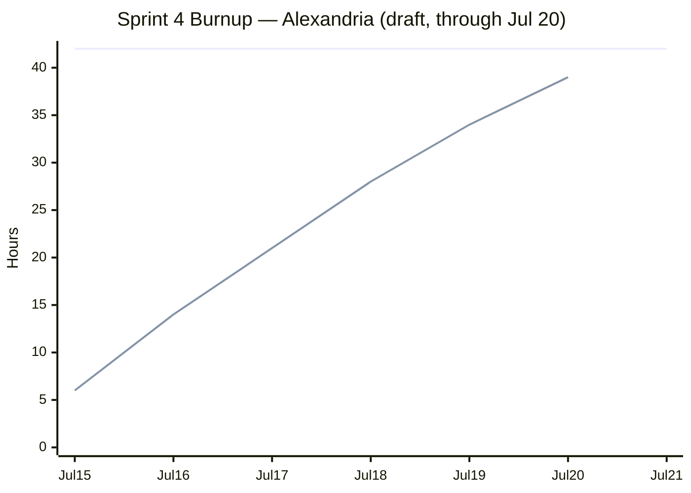

# Sprint 4 Report

**Product:** Alexandria (Prompt Optimization for LLM Applications / Coding Agent) ·
**Team:** Alexandria ·
**Date:** Jul 20, 2026 ·
**Status:** DRAFT (in progress). The sprint ends Jul 21, 2026. This draft covers work through
Jul 20 and will be finalized after the last sprint day.

## Actions to stop doing

- Stop letting docs describe infrastructure that is planned but not merged. `CONTRIBUTING.md`
  documents an "Optimization quality" CI workflow and a committed baseline, but neither the workflow
  file (`.github/workflows/optimization-quality.yml`) nor `benchmarks/optimization_baseline.json`
  is on `main`. Docs should describe what is merged.

## Actions to keep doing

- Keep landing small, reviewable PRs. Sprint 4 moved the benchmark harness, the compression controls,
  the pipeline split, and the docs rewrite through short issue-sized PRs.
- Keep publishing raw benchmark artifacts with the exact commands that produced them. Results live
  under `benchmarks/*/results/`, so a reader can reproduce a run rather than trust a summary.
- Keep landing tests alongside features. The benchmark plumbing shipped with a deterministic smoke
  test, and the semantic-budget figures shipped with a test that checks the figure outputs.

## Work completed / not completed

### Completed

- **User story 1: publish the default benchmark result.** A shared prompt-compression benchmark
  harness (#110) plus BABILong 8k (#102), RULERv2, and IFEval (#97, #100) benchmarks. The n50 runs
  were recorded and published (#113), and the README "Benchmark" section now reports accuracy, token
  reduction, wall-clock time, and cost with figures. The semantic-budget evidence and the
  retained-context curve are published. Raw artifacts are saved under `benchmarks/*/results/`.
- **User story 2: compression-strength sweep, with a negative decision.** Budget-controlled sweeps
  were added and run over retained-percent (keep50–90 n50, keep75–95 n50) and `cos_sim_diff` budget
  (cos-budget n50). Supporting compression work landed: the hard-target guarantee (#106),
  `--target-reduction` (#101), `--keep` percent (#99), prune-first target compression (#104),
  parallel best-of-3 target merge (#109), and semantic-merge compression (#98).
- **User story 4: verify the release install path.** Public-readiness cleanup for open source (#116)
  landed. Install is documented via `uv tool install git+…`, and the tool stopped persisting provider
  identifiers. PyPI publication was not done; install is via the git URL for now.
- **User story 5: prepare the project for open-source contributors.** Implementation-aligned docs
  (#117) landed. The README was rewritten for OSS readers, and `docs/cli.md`, `docs/library.md`,
  and `docs/tech-stack.md` were refreshed. The contribution guide was consolidated into a root
  `CONTRIBUTING.md`.
- **Enabler A: reproducible benchmark artifacts.** The results-directory convention and the
  `report.md` format are established, a benchmark runner guide was added, and a deterministic
  benchmark smoke test landed.

### Not completed (planned but unfinished)

- **User story 3: monitor optimization quality in CI.** Quality monitoring was worked on and merged
  on a branch (#115), and `CONTRIBUTING.md` documents the workflow and baseline, but the CI
  regression gate did not land on `main`. The workflow file and the baseline JSON are not on `main`,
  and CI still runs only lint, format, pyright, import-linter, and pytest. The regression check does
  not run on push or pull request yet.

### Supporting work (not new user stories)

- Split `ops/pipe.py` into `pipe`, `features/target`, and `ops/report` (#112).
- Standardized `cos_sim_diff` terminology (#111).
- Cached embeddings in `TrackedEmbedder` and vectorized the similarity hot paths.
- Added a sentence segmenter (#107) and an embedding-cluster analysis notebook (#108), and stripped
  notebook outputs (#114).
- Late in the sprint: a Team Working Agreement, a Test Plan and Report, a Release Summary, a
  consolidated `CONTRIBUTING.md`, and live end-to-end tests behind a pytest `ai` marker (skipped
  without an OpenAI key).

## Work completion rate

- User stories completed: 4 of 5 (US1, US2, US4, and US5). US3 did not land on `main`.
- Enabler A completed.
- Actual work hours: 39 (estimated, draft). Covers Jul 15 through Jul 20, 6 of the 7 sprint days.
- Days elapsed in sprint: 6 of 7 (Jul 15–20, sprint ends Jul 21).
- User stories / day so far: 0.67 (4 / 6).
- Actual work hours / day so far: 6.5.
- Average across all sprints to date (Sprints 1–4, 27 days, draft estimate that includes this
  in-progress sprint): about 0.30 user stories / day and 5.7 actual work hours / day.

US3 is the only planned story not on `main`.

Hours are estimated actual time, using git-log dates and the plan's task sizes where they match the
work. Because the sprint is not over, the total is a draft estimate to date, not a final count.

| PR | Work | Hours |
|----|------|------:|
| — | Sprint 3 report revisions + Sprint 4 plan/docs (direct to `main`) | 2 |
| #110, #97, #100, #102 | US1: shared benchmark harness + BABILong 8k, RULERv2, IFEval | 8 |
| #113 | US1: n50 runs recorded, results published in README | 4 |
| #98, #99, #101, #104, #106, #109 | US2: compression controls (keep/target/prune/merge) | 9 |
| — | US2: budget-controlled sweeps | 4 |
| #116 | US4: public-readiness cleanup, git-URL install path | 3 |
| #117 | US5: README rewrite + cli/library/contributing/tech-stack docs | 5 |
| #107, #108, #114 | Enabler A + support: smoke test, segmenter, notebook, output strip | 3 |
| #111, #112 | Support: pipeline split + `cos_sim_diff` terminology | 1 |
| **Total (estimated, draft)** | | **39** |

US3 (CI regression gate) contributes 0 hours to the completed total because it did not land on
`main`; work on branch #115 is not counted here.

### Sprint 4 burnup chart

The scope line is the committed 42 hours. The completed line tracks estimated actual work hours by
git-log date through Jul 20 and stops at 39, leaving the Jul 21 remainder (the US3 CI gate and final
sprint-day work) still open.

