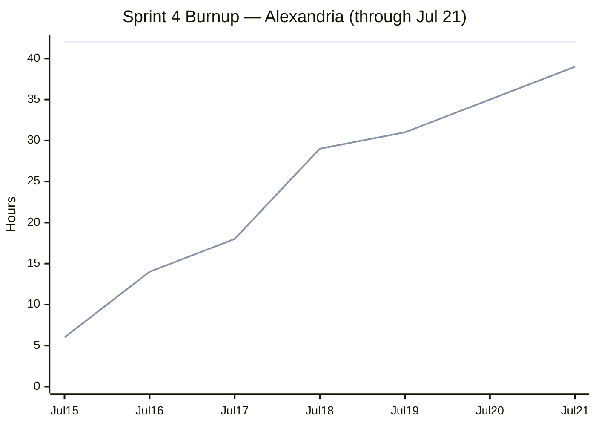

# Sprint 4 Report

**Product:** Alexandria (Prompt Optimization for LLM Applications / Coding Agent) ·
**Team:** Alexandria ·
**Date:** Jul 21, 2026 ·
**Status:** DONE

## Actions to stop doing

- Stop describing planned infrastructure as shipped. PR #115 documented a proposed optimization-
  quality CI workflow without adding the workflow or a committed baseline. PR #129 corrected the
  OSS-facing docs to state that the repository does not run this comparison in CI.

## Actions to keep doing

- Keep landing small, reviewable PRs. Sprint 4 moved the benchmark harness, the compression controls,
  the pipeline split, and the docs rewrite through short issue-sized PRs.
- Keep publishing raw benchmark artifacts with the exact commands that produced them. Results live
  under `benchmarks/*/results/`, so a reader can reproduce a run rather than trust a summary.
- Keep landing tests alongside features. The benchmark plumbing shipped with a deterministic smoke
  test, and the semantic-budget figures shipped with a test that checks the figure outputs.

## Work completed / not completed

### Completed

- **User story 1: publish the default benchmark result.** A shared prompt-compression benchmark
  harness (#110) plus BABILong 8k (#102), RULERv2, and IFEval (#97, #100) benchmarks. The n50 runs
  were recorded and published (#113), and the README "Benchmark" section now reports accuracy, token
  reduction, wall-clock time, and cost with figures. The semantic-budget evidence and the
  retained-context curve are published. Raw artifacts are saved under `benchmarks/*/results/`.
- **User story 2: compression-strength sweep, with no default change.** Earlier retained-percent and
  `cos_sim_diff` budget runs were followed by a dedicated P0–P6 matrix and runbook (#123), execution
  with committed raw artifacts (#124), and a synthesis report (#127). P7–P9 were deferred because of
  API-budget limits. No evaluated point cleared the release gate, so the shipped `Params()` default
  stayed unchanged. Supporting compression work landed in #98, #99, #101, #104, #106, and #109.
- **User story 4: verify the release install path.** Public-readiness cleanup (#116) and a release
  installation smoke test, CI step, and install guide (#126) landed. Install is documented via
  `uv tool install git+…`; PyPI publication was not done.
- **User story 5: prepare the project for open-source contributors.** Implementation-aligned docs
  (#117), public packaging and README work (#118), and the final OSS community setup (#129) landed.
  The repository now includes the contribution and security policies, issue forms, and a pull
  request template alongside refreshed CLI, library, and tech-stack documentation.
- **Enabler A: reproducible benchmark artifacts.** The results-directory convention and the
  `report.md` format are established, a benchmark runner guide was added, and a deterministic
  benchmark smoke test landed.

### Not completed (planned but unfinished)

- **User story 3: monitor optimization quality in CI.** PR #115 merged to `main` on Jul 19, but it
  changed only `README.md` and `docs/contributing.md`; it did not add the planned workflow or
  committed baseline. The final CI runs lint, format, pyright, import-linter, pytest, release-install
  verification, and coverage reporting, but no optimization-quality comparison. PR #129 corrected
  the contributor docs to match that implementation.

### Supporting work (not new user stories)

- Split `ops/pipe.py` into `pipe`, `features/target`, and `ops/report` (#112).
- Standardized `cos_sim_diff` terminology (#111).
- Cached embeddings in `TrackedEmbedder` and vectorized the similarity hot paths.
- Added a sentence segmenter (#107) and an embedding-cluster analysis notebook (#108), and stripped
  notebook outputs (#114).
- Added final-submission documents and revisions (#119, #125), a CLI demo notebook (#120), and an
  updated layered-architecture diagram (#128).
- Raised offline test coverage to 95.41% with additional browser-review, target, report, merger, and
  pipeline tests (#130).

Merge dates use America/Los_Angeles, matching the sprint calendar. PRs #131–#133 merged after the
Jul 21 sprint boundary and are not included in this report.

## Work completion rate

- User stories completed: 4 of 5 (US1, US2, US4, and US5). US3 did not meet its acceptance criteria.
- Enabler A completed.
- Completed planned work: 39 of 42 ideal hours (estimated).
- Days elapsed in sprint: 7 of 7 (Jul 15–21).
- User stories / day: 0.57 (4 / 7).
- Completed ideal hours / day: 5.6.
- Average across all sprints to date (Sprints 1–4, 28 days): about 0.29 user stories / day and
  5.5 estimated hours / day.

US3 is the only planned story not completed.

Hours are estimated completion credit based on the plan's task sizes and merge evidence. Some PRs
span more than one row; their work is allocated to the applicable story or enabler rather than
counted by PR.

| PR | Work | Hours |
|----|------|------:|
| #97, #100, #102, #110, #113 | US1: benchmark protocol, runs, statistics, and publication | 13 |
| #98, #99, #101, #104, #106, #109, #118, #123, #124, #127 | US2: controls, sweep, and final default decision | 10 |
| #116, #126 | US4: public-readiness cleanup and release-install verification | 5 |
| #117, #118, #129 | US5: OSS-facing docs and contributor setup | 7 |
| #107, #108, #110, #114 | Enabler A: reproducible benchmark plumbing and artifacts | 4 |
| **Total (estimated)** | | **39** |

US3 contributes 0 completed hours because #115 did not satisfy its CI workflow and baseline
acceptance criteria.

### Sprint 4 burnup chart

The scope line is the committed 42 ideal hours. The completed line shows day-end estimates from merge
history through Jul 21. The final four hours represent the US2 runbook, sweep artifacts, and
synthesis merged in #123, #124, and #127; the remaining three-hour gap is unfinished US3.

```mermaid
xychart-beta
    title "Sprint 4 Burnup — Alexandria (through Jul 21)"
    x-axis [Jul15, Jul16, Jul17, Jul18, Jul19, Jul20, Jul21]
    y-axis "Hours" 0 --> 42
    line [42, 42, 42, 42, 42, 42, 42]
    line [6, 14, 18, 29, 31, 35, 39]
```
