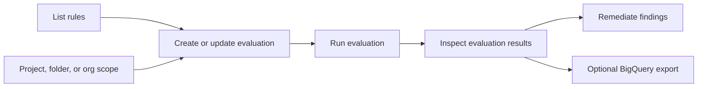

# Workload Manager Basics

Workload Manager validates enterprise workloads against Google Cloud best
practices and recommendations. The public client libraries are centered on
evaluations: define a resource scope, choose built-in or custom rules, run an
evaluation, then inspect results and scanned resources.

## Use This Flow



## Core API Constraints

To ensure compatibility, security, and successful integration:

*   **Public Surface Only:** You MUST strictly interact with Workload Manager
    using the official public `google-cloud-workloadmanager` client library or
    the public REST API (`workloadmanager.googleapis.com/v1`).
*   **No Internal or Undocumented APIs:** Do NOT attempt to use internal RPC
    protocols, private service backends, or undocumented discovery mechanisms.
    They are not supported for public integrations and will fail.
*   **No Service-Specific CLI:** There is no public `gcloud workload-manager`
    CLI command group. Use `gcloud` only for authentication, IAM role
    assignment, and fetching raw REST tokens.
*   **Sandbox Execution Robustness (Auth/Mock Fallbacks):** When gcloud
    authentication or Workload Manager API calls fail in sandboxed or restricted
    environments (e.g., due to Context Aware Access token blocks, missing API
    enablement, or
    mock resources returning 404/403), immediately fall back to presenting
    example code and static findings from your references instead of entering
    retry loops. Present the correct client library code structure or REST API
    payload example, clearly explain the auth or resource limitation, and list
    typical rules or mock findings statically to satisfy the request.

## Prerequisites

1.  Enable the Workload Manager API:

    ```bash
    gcloud services enable workloadmanager.googleapis.com --quiet
    ```

2.  Authenticate locally using Application Default Credentials (ADC) before
    using client libraries:

    ```bash
    gcloud auth application-default login
    ```

3.  Ensure the Workload Manager service agent has the required roles granted in
    your project (mandatory for API/client library usage, see
    [IAM & Security](references/iam-security.md)).

4.  Grant the least-privileged role needed for the task. Start with
    `roles/workloadmanager.viewer` for read-only access to evaluation resources
    and use `roles/workloadmanager.evaluationAdmin` or
    `roles/workloadmanager.admin` only when creating, updating, running, or
    deleting evaluations.

## Quick Client Library Example

Use the Python client library for the first working automation path:

```bash
python3 -m pip install --upgrade google-cloud-workloadmanager
```

```python
from google.cloud import workloadmanager_v1

project_id = "PROJECT_ID"
location = "LOCATION"
parent = f"projects/{project_id}/locations/{location}"

client = workloadmanager_v1.WorkloadManagerClient()

rules = client.list_rules(
    request=workloadmanager_v1.ListRulesRequest(
        parent=parent,
        evaluation_type=workloadmanager_v1.Evaluation.EvaluationType.OTHER,
    )
)

for rule in rules.rules:
    print(rule.name, rule.display_name, rule.severity)
```

## Reference Directory

-   [Core Concepts](references/core-concepts.md): Evaluations, rules, results,
    scanned resources, supported workload types, and API shape.

-   [General Best Practices](references/general-best-practices.md): Google Cloud
    general best-practice posture checks, `OTHER` evaluation guidance, custom
    Rego rules, and scale/automation patterns.

-   [Client Libraries](references/client-library-usage.md): Python and Go client
    library examples for listing rules, creating evaluations, running
    evaluations, and reading findings.

-   [REST Usage](references/rest-usage.md): Direct REST examples for the public
    Workload Manager API and operations polling.

-   [Public CLI Status](references/public-cli-status.md): No documented
    service-specific `gcloud workload-manager` command group; use `gcloud` only
    for auth, IAM, API enablement, and REST tokens.

-   [Public MCP Status](references/public-mcp-status.md): No documented public
    Workload Manager MCP server; use client libraries or REST API instead.

-   [Setup Prerequisites](references/setup-prerequisites.md): Terraform examples
    only for adjacent prerequisites such as API enablement, IAM, BigQuery export
    datasets, and KMS keys. This is not Workload Manager resource management.

-   [IAM & Security](references/iam-security.md): Workload Manager roles,
    least-privilege guidance, service agents, data handling, and CMEK notes.

If product behavior or API fields are not covered here, check the current
Workload Manager product documentation and client library reference before
implementing.

## Authoritative References

-   [Workload Manager overview](https://docs.cloud.google.com/workload-manager/docs/overview)
-   [Google Cloud best practices](https://docs.cloud.google.com/workload-manager/docs/reference/best-practices-general)
-   [Workload Manager REST API](https://docs.cloud.google.com/workload-manager/docs/reference/rest)
-   [About custom rules](https://docs.cloud.google.com/workload-manager/docs/evaluate/custom-rules/about-custom-rules)
-   [Write custom rules using Rego](https://docs.cloud.google.com/workload-manager/docs/evaluate/custom-rules/rego-custom-rules)
-   [Python package](https://pypi.org/project/google-cloud-workloadmanager/)
-   [Workload Manager IAM roles](https://docs.cloud.google.com/iam/docs/roles-permissions/workloadmanager)
-   For additional information, use the Developer Knowledge MCP server `search_documents` tool.

## Additional Context

-   [Mastering cloud posture management with Workload Manager](https://discuss.google.dev/t/mastering-cloud-posture-management-security-reliability-and-finops-with-workload-manager/318258)
