# Competencia de Análisis Posterior a Incidentes

Esta competencia genera un documento postmortem de incidente completo y sin culpables, siguiendo el formato estándar de la industria. El resultado refuerza el encuadre sin culpables en todo el documento — brechas en los sistemas sobre fallos individuales — e impulsa hacia elementos de acción específicos y cerrables en lugar de compromisos vagos de procesos.

## Propone Acciones

Los elementos de acción no tienen que permanecer en la página: envíalos a [`action-runner`](../action-runner/SKILL.md), que los avanza (simulación, calificación de riesgo), ejecuta solo lo que apruebas a través del MCP de acción conectado, y registra qué se hizo en el cerebro. Típico: **crear un issue de seguimiento por elemento de acción** (🟡), asignado a su responsable con fecha de vencimiento. Esta competencia propone; action-runner valida y ejecuta — nunca en silencio.

## Entradas Requeridas

Pregunta al usuario por estas si no están proporcionadas:
- **Título / ID del incidente**
- **Gravedad** (P1 / P2 / P3 o SEV1 / SEV2 / SEV3)
- **Fecha y duración** del incidente
- **Qué sucedió** (notas aproximadas están bien — la competencia las estructurará)
- **Servicios o sistemas afectados**
- **Impacto en clientes** (cuántos usuarios, qué se degradó)
- **Cómo se detectó**
- **Cómo se resolvió**
- **Primeras reflexiones sobre la causa raíz**
- **Elementos de acción ya identificados** (opcional)
- **Respondedores** (quién estaba de guardia o respondió — nombres o roles; se usan para la línea de tiempo, no para culpa)
- **Comunicaciones con clientes o externas enviadas** (opcional — actualizaciones de página de estado, correos o mensajes de soporte con marcas de tiempo)

## Lee / Escribe en el Cerebro

Si existe un [`professional-brain`](../professional-brain/SKILL.md) (`brain/`), úsalo primero:

- **Lee primero:** el archivo `entities/` del sistema afectado y cualquier `decisions/` relacionada o incidente previo (las causas raíz recurrentes son lo más importante que mostrar).
- **Escribe después:** registra los elementos de acción y decisiones en `decisions/`, y el aprendizaje de causa raíz en `knowledge/` — etiqueta una causa medida como `[data]` y una sospechada como `[hunch]`, nunca al revés.

## Materiales Más Profundos

- **`references/root-cause-digging.md`** — cinco "por qué" hecho correctamente (detente en una propiedad de sistema modificable, ramifica en cadenas de causa/detección/respuesta), una taxonomía de factores contribuyentes para barrer, y reescrituras de lenguaje de culpa → sistémica. Úsalo mientras escribes la sección de Causa Raíz y para reencuadrar cualquier nota de entrada culpable.
- **`templates/review-meeting-agenda.md`** — una agenda de 45 minutos centrada en documentos para la reunión de revisión postmortem, con reglas de base y una puerta de control de calidad de elementos de acción. Ofrécela junto con el postmortem terminado.

## Formato de Salida

---

# Análisis Posterior a Incidente: [Título del Incidente]

**ID del Incidente:** [ID]
**Gravedad:** [P1/P2/P3]
**Fecha:** [Fecha]
**Duración:** [Hora de inicio → Hora de resolución — duración total]
**Estado:** [Resuelto / Monitorizado / En Curso]
**Autor:** [Dejar en blanco para que el usuario complete]
**Última actualización:** [Fecha]

---

## Resumen Ejecutivo

[3–5 oraciones. Describe qué sucedió, quién se vio afectado y qué se hizo para resolverlo. Escrito para un stakeholder no técnico. Sin jerga. Sin culpa.]

---

## Impacto

| Dimensión | Detalles |
|---|---|
| **Usuarios afectados** | [Número o porcentaje] |
| **Servicios degradados** | [Listar servicios afectados] |
| **Impacto empresarial** | [Ingresos, incumplimiento de SLA, tickets de soporte, etc. si se conoce] |
| **Duración** | [Tiempo total desde la primera detección hasta la resolución completa] |

---

## Línea de Tiempo

Lista eventos en orden cronológico. Cada entrada: `[HH:MM UTC] — [Qué sucedió. Qué hizo quién. Qué cambió.]`

Reglas para entradas de línea de tiempo:
- Usa lenguaje pasivo o enfocado en el sistema — evita "X cometió un error"
- Incluye: primer síntoma, detección, escalada, hipótesis probada, corrección aplicada, confirmación de resolución
- Anota tiempo entre eventos clave (ej. "22 minutos entre detección y escalada")

**Línea de tiempo, dibujada** — también renderiza la línea de tiempo del incidente como un Gantt de Mermaid para que las brechas (ej. detección → escalada) sean visibles de un vistazo (se renderiza en vivo en el playground y se exporta como PNG). Usa las fases del incidente como barras; mantén el encuadre sin culpables y enfocado en el sistema:

```mermaid
gantt
    title Línea de tiempo del incidente (UTC)
    dateFormat HH:mm
    axisFormat %H:%M
    section Fases
        Impacto no detectado   :22:00, 18m
        Detección           :milestone, 22:18, 0m
        Investigación       :22:18, 22m
        Mitigación          :22:40, 15m
        Resuelto            :milestone, 22:55, 0m
```

---

## Causa Raíz

**Causa raíz primaria:** [Una oración clara. Técnica pero llana. "Una configuración de despliegue mal configurada causó..."]

**Factores contribuyentes:**
- [Factor 1 — ej. la falta de despliegue canario significó que el cambio afectó el 100% del tráfico inmediatamente]
- [Factor 2 — ej. el umbral de alerta se estableció demasiado alto para detectar la degradación inicial]
- [Factor 3 — agrega tantos como sean relevantes]

**¿Por qué nuestras salvaguardas existentes no lo previnieron?**
[Párrafo honesto explicando por qué el monitoreo, las pruebas o los procesos no lo detectaron antes. Aquí es donde el análisis sin culpables importa más — enfócate en brechas del sistema, no en fallos individuales.]

---

## Detección

- **¿Cómo se detectó primero?** [Reporte de cliente / alerta automatizada / monitoreo interno / observación manual]
- **Tiempo desde el inicio del incidente hasta la detección:** [X minutos]
- **¿Deberíamos haberlo detectado más rápido?** [Sí / No — y por qué]

---

## Resolución

**¿Qué lo arregló?** [Descripción clara de la corrección real — un párrafo]
**¿Por qué funcionó esto?** [Breve explicación técnica]
**¿Hubo una mitigación temporal antes de la resolución completa?** [Sí/No — describe si es sí]

---

## Elementos de Acción

| # | Acción | Responsable | Fecha de Vencimiento | Prioridad |
|---|---|---|---|---|
| 1 | [Acción específica y comprobable] | [Equipo o persona] | [Fecha] | P1/P2/P3 |

Reglas para elementos de acción:
- Cada acción debe ser específica suficiente para cerrarse como "hecha" o "no hecha" — sin elementos vagos como "mejorar monitoreo"
- Distingue entre: **Prevenir recurrencia** (arreglar la causa raíz), **Mejorar detección** (detectarlo más rápido la próxima vez), **Mejorar respuesta** (resolverlo más rápido la próxima vez)
- Asigna un propietario real — no "equipo" o "TBD" si es evitable
- Marca acciones P1 como elementos que bloquean que el incidente se marque como completamente cerrado

---

## Qué Salió Bien

[3–5 observaciones honestas sobre la respuesta. Incluye: colaboración rápida, runbooks buenos utilizados, escalada efectiva, comunicación clara. Esta sección construye confianza en el equipo y refuerza buenos hábitos.]

---

## Lecciones Aprendidas

[3–5 insights clave de este incidente que vale la pena compartir más allá de este equipo. Escribe estas como lecciones transferibles — ej. "Nuestro runbook para failover de base de datos no tenía en cuenta el retraso de réplica de lectura. Todos los runbooks que involucren failover de base de datos deben ser revisados."]

---

## Registro de Comunicaciones

[Opcional — lista comunicaciones externas enviadas: actualizaciones de página de estado, correos a clientes, respuestas de soporte. Incluye marcas de tiempo.]

---

## Controles de Calidad

- [ ] La línea de tiempo no tiene lenguaje enfocado en culpa
- [ ] La causa raíz es específica (no "error humano")
- [ ] La causa raíz responde "¿por qué sucedió esto?" no solo "¿qué sucedió?" — nombra una brecha de sistema o proceso, no un síntoma
- [ ] Los factores contribuyentes explican las brechas sistémicas
- [ ] Cada elemento de acción tiene un responsable y fecha de vencimiento
- [ ] La sección "Qué salió bien" es genuina, no superficial
- [ ] Ningún elemento de acción contiene lenguaje vago como "mejorar monitoreo", "aumentar resiliencia" o "mejor testing" — cada uno debe nombrar un cambio específico
- [ ] El resumen ejecutivo es legible por liderazgo no técnico

## Anti-Patrones

- [ ] No asignes culpa a individuos — los postmortems deben enfocarse en fallos de sistema y proceso
- [ ] No escribas elementos de acción con lenguaje vago como "mejorar monitoreo" — cada uno debe nombrar un cambio específico y asignable
- [ ] No omitas los factores contribuyentes — la causa raíz sola pierde los problemas sistémicos que habilitan incidentes
- [ ] No omitas la línea de tiempo de detección — cuánto tiempo tardó en detectarse importa tanto como cuánto tardó en resolverse
- [ ] No trates el postmortem como cerrado hasta que todos los elementos de acción tengan responsables y fechas de vencimiento nombrados

## Ejemplos de Uso
- "Redacta un postmortem para la caída de [nombre del incidente]"
- "Ayúdame a escribir un informe de incidente P1"
- "Genera un documento RCA para [servicio] caído el [fecha]"
- "Redacta un postmortem sin culpables a partir de estas notas: [pega notas]"
