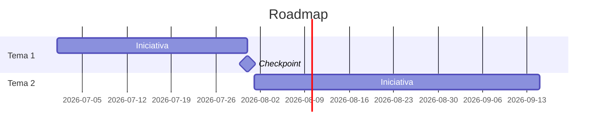

# Skill de Narrativa de Roadmap

Convierte una lista clasificada de iniciativas de producto en una narrativa clara y estratégica que conecte elementos individuales con objetivos empresariales y comunique una dirección de producto coherente.

## Lee desde / Escribe en el Brain

Si existe un [`professional-brain`](../professional-brain/SKILL.md) (`brain/`), fundamenta en él en lugar de volver a preguntar lo que ya sabes:

- **Lee primero:** `knowledge/strategy.md` (la dirección a la que debe escalonarse la narrativa), `decisions/` prioritarios, y `entities/` de características. Ejecuta `python3 ../professional-brain/scripts/brain_query.py ./brain "<tema de roadmap>"` y mantén la etiqueta de procedencia de cada hecho a través del documento.
- **📥 Proponer al Brain:** después de producir, propón registrar las decisiones de secuenciación/prioridad en `decisions/` y actualizar las `entities/` de características relevantes, cada una etiquetada con procedencia. Muéstralas, obtén un sí, luego escribe con `../professional-brain/scripts/brain_write.py … --commit` (append-only, dry-run por defecto).

## Trabajar desde un brief

A menudo recibirás un brief corto (unos pocos temas, una audiencia) sin una lista completa de iniciativas u OKRs. **Siempre entrega la narrativa completa de todas formas** — no te detengas para hacer preguntas ni dejes placeholders entre corchetes como `[Nombre del Tema]`. Donde falte detalle, infiere temas, iniciativas y métricas específicas y realistas del brief y el dominio, y marca cualquier hecho o número inferido como *(asumido — confirma)*. Completa cada sección con contenido concreto, no brackets de plantilla.

## Inputs (infiere cualquiera que no se proporcione — etiqueta suposiciones)

- **Lista de iniciativas priorizadas** (con cronogramas aproximados o trimestres)
- **OKRs o prioridades estratégicas de la empresa** (para conectar el roadmap con objetivos empresariales)
- **Audiencia** (all-hands, junta directiva, inversores, equipo de ventas — cambia tono y profundidad)
- **Elementos explícitamente NO en el roadmap** (opcional pero fortalece credibilidad)

## Proceso
1. Revisa la lista de iniciativas priorizadas y OKRs empresariales proporcionados
2. Identifica 2-3 temas estratégicos que agrupen naturalmente las iniciativas
3. Para cada tema, articula: el problema que aborda, el cliente al que sirve, la métrica que mueve
4. Redacta una narrativa a nivel trimestral que muestre progresión — ¿cómo H1 prepara H2?
5. Redacta un resumen ejecutivo (máximo 3-4 oraciones) que stakeholders no técnicos puedan repetir
6. **Valida** — Confirma que cada iniciativa se asigna a un tema. Si una iniciativa está huérfana, o crea un tema o señálala como brecha narrativa a abordar

## Estructura del Output

### Roadmap de Producto: [Trimestre/Semestre/Año]
**Contexto Estratégico:** [1 párrafo: momento de mercado, desafío clave, nuestra respuesta]

#### Tema 1: [Nombre del Tema]
- Justificación estratégica
- Iniciativas incluidas
- Métrica primaria impactada
- Dependencias

[Repite para cada tema]

**Qué No Está en el Roadmap (y Por Qué):**
[2-3 elementos con justificación — demuestra disciplina estratégica, no solo priorización]

**Resumen Ejecutivo (compartible):**
[3-4 oraciones que podrían compartirse en una actualización all-hands o de junta directiva]

## Directrices de Tono
- Escribe para un CFO, no para un ingeniero
- Lidera con resultados para el cliente, no características
- Sé honesto sobre qué NO está en el roadmap y por qué

## Cronograma, dibujado
Cuando los temas tienen una secuencia o fechas, también renderiza el roadmap como un gráfico Gantt de Mermaid para que la forma del plan sea visible (se renderiza en vivo en el playground; con fechas ISO reales también exporta a un calendar .ics). Usa `section` por tema/trimestre y marca checkpoints clave como milestones.

## Verificaciones de Calidad

- [ ] Cada iniciativa en el input se asigna a un tema estratégico
- [ ] El resumen ejecutivo puede estar de pie solo y ser repetido correctamente después de una lectura
- [ ] La narrativa de progresión muestra enlaces causales entre trimestres (no solo listado cronológico)
- [ ] La sección "qué no está en el roadmap" incluye al menos 2 elementos con justificación clara
- [ ] El lenguaje es libre de jerga técnica — probado preguntando: "¿podría un CFO repetir esto?"

## Anti-Patrones

- [ ] No produzcas una lista de características con fechas y la llames narrativa — cada iniciativa debe conectarse a un tema estratégico
- [ ] No omitas la sección "qué no está en el roadmap" — sin ella, la narrativa carece de disciplina estratégica
- [ ] No escribas la progresión como lista cronológica — muestra enlaces causales entre trimestres (Q1 habilita Q2 porque…)
- [ ] No escribas el resumen ejecutivo al final y lo trates como un resumen — escríbelo como la versión que stakeholders repetirán
- [ ] No dejes iniciativas huérfanas sin tema — o crea un tema o señala explícitamente la brecha
